# 数据分析

## 数据分析概述

### 什么是数据分析

**数据分析是什么?**

- 用适当的统计分析的方法, 对收集来的大量数据进行分析, 从中提取出有用的信息.

**数据分析的目的:**

- 提取出数据背后的信息, 用来帮助管理者进行判断和决策.

**数据分析的作用:**

- **现状分析**: 告诉你从过去到现在发生了什么.
  - 告诉你企业现阶段整体, 和各项业务的运营情况. 以及它们各自的发展和变动情况;
  - 日报, 周报, 月报, 等形式;
- **原因分析**: 告诉你某一现状为什么发生.
  - 在对运营情况大概了解之后, 原因分析帮你了解运营情况具体好在哪里, 坏在哪里, 引发的原因是什么;
  - 🌰 2012 年 2 月收入环比下降 $10\%$, 那具体是什么原因导致的呢? 是各项业务收入都下降了, 还是个别业务收入下降了?
- **预测分析**: 告诉你将来会发生什么.
  - 在了解了运营现状之后, 对企业未来发展趋势做出预测, 为未来的运营目标和策略制定, 提供参考和依据;

### 数据分析步骤

```mermaid
graph LR;

A(明确目的 + 思路)
B(数据收集)
C(数据处理)
D(数据分析)
E(数据展现)
F(报告撰写)

A --> B --> C --> D --> E --> F
```

**明确目的 + 思路**:

- 分析之前需要明确目标. 通过这次数据分析我要解决什么问题?
- 明确目标之后, 梳理分析思路, 搭建分析框架. 把分析目的分解为几个不同的分析要点, 即需要从哪几个角度进行分析, 采用哪些分析指标;
- 分析框架需要 "体系化", 也就是确定好先分析什么, 后分析什么, 各个分析点之间有逻辑联系, 使分析框架具备可信度和说服力;
- 需要以专业理论为指导, 结合具体业务情况, 和个人经验来搭建分析框架, 从能使其成体系化, 分析结果具有正确性;

**数据收集**:

- 依照确定好的分析框架, 收集相关的数据的过程;
- 一般数据来源有: 数据库, 公开出版物, 互联网, 市场调查;

**数据处理**:

- 对收集到的数据进行加工整理, 形成适合数据分析的样式;
- 收集来的数据往往是杂乱无章的, 夹杂着大量与目标问题无关的数据, 我们需要从中提取出对解决问题有价值, 有意义的数据;

**数据分析**:

- 指用适当的分析方法和工具, 对处理过的数据进行分析, 提取出有价值的信息, 形成有效的结论的过程;
- 数据分析师不仅要掌握各种分析方法, 还要梳理主流的分析软件;

**数据展现**:

- 通过可视化的方式将数据展现出来, 直观地传递出分析师要表达的观点;

**报告撰写**:

- 对整过分析过程的一个总结和呈现. 把数据分析的起因, 过程, 结果, 建议完整地呈现出来, 供决策者参考;
- 分析报告一定要包含 "结论" 和 "建议". 因为最初进行分析的目的, 就是为了找到一个结论. 并且决策者不仅关心问题是什么, 还需要你给出一个建议或解决方案以供参考;

### 常用指标 & 术语

- **平均数**: 将全部数据累加后除以数据个数. 代表数据集内的一般水平, 掩盖各数据间的差异;
- **绝对数 & 相对数**:
  - 绝对数, 是反映客观现象总规模, 总水平的指标;
    - 🌰 例如, GDP, 总人口, 数量增减变化, etc.
  - 相对数, 是由两个有联系的数值对比计算而得到的数值, 是反映客观现象之间的数量联系程度的照顾指标;

- **百分比 & 百分点**:
  - 百分比, 是相对数的一种, 表示一个数是另一个数的百分之几, 也称为百分数, 百分率;
    - 🌰 例如, 8%, 100%, 50%;
  - 百分点, 表示百分比之间的变动幅度;
    - 🌰 例如, 50% 与 20% 之间相差 30 个百分点;

- **频数 & 频率**:
  - 频数, 指一组数据中某类数据出现的次数;
  - 频率, 指某类数据的频数与整组数据数量的比值;
- **比例 & 比率**:
  - 比例, 指总体中各部分的数值占全部数值的比重, 反映部分与整体的关系;
  - 比率, 指不同类别数值之间的对比, 反映整体中各部分之间的关系;

- **倍数 & 番数**:

  - 倍数, 是一个数除以另一个数所得的商;
    - 🌰 A / B = C, A 就是 B 的 C 倍.
  - 番数, 指原来数量的 2 的 N 次方倍;
    - 🌰 翻 1 番就是指原来数量的 $2^1 = 2$ 倍, 翻 2 番就是原来数量的 $2^2 = 4$ 倍;

- **同比 & 环比**:
  - 同比, 指同历史同时期进行比较得到的数值;
    - 🌰 2010 年 1 月 vs 2011 年 1 月;
  - 环比, 指同前一个统计期进行比较得到的数值;
    - 🌰 2010 年 1 月 vs 2010 年 2 月;

### 其他

**数据科学家 vs 商业分析师**:

## 分析思路

### 什么是数据分析方法论

数据分析需要在正确合理的 "数据分析方法论" 指导之下进行. 否则可能面对数据不知道如何着手分析, 分析的结果也可能不具备正确性.

**数据分析方法论 vs 数据分析法**:

- 数据分析方法论, 从宏观的角度指导如何进行数据分析. 比如从哪些方面来开展分析工作? 各个方面包含什么内容和指标?
- 数据分析法, 从微观角度来指导具体如何进行数据分析;

**数据分析方法论的主要作用**:

- 理顺分析思路, 确保数据分析结构体系化;
- 把问题分解成相关联的部分, 并厘清各部分的关系;
- 为后续分析的开展指引方向;
- 确保分析结果的正确性;

### 常用的数据分析方法论

#### PEST 分析法

『 **PEST 分析法** 』主要用于对『 **宏观环境** 』的分析。

- 宏观环境, 是指影响一切行业和企业的各种宏观力量. 主要包括:『 **政治, 经济, 技术, 社会** 』

🌰 用『 PEST 分析法 』去构建『 **中国互联网行业分析框架** 』:

- **政治**: 国家出台的相关政策? 相关法律? 有何影响?
- **经济**: GDP 及增长率, 消费价格指数, 失业率, 居民可支配收入?
- **社会**: 中国网民人口规模, 性别比例, 年龄结构, 人口分布, 收入水平, 教育情况, 购买习惯, 宗教信仰?
- **技术**: 国家重点支持项目, 技术? 技术人才数量? 技术发展趋势? 技术更新需求, 速度? 技术商品化速度?

#### 5W2H 分析法

『 **5W2H 分析法** 』用 5 个 W 开头的单词和 2 个 H 开头的单词进行提问, 然后从回答中发现解决问题的线索:

- **Why 何因**, **What 何事**, **Who 何人**, **When 何时**, **Where 何地**, **How 如何**, **How much 何价**

- 基本上任何事情都可以用『 5W2H 分析法 』去分析;

🌰 用『 5W2H 分析法 』去分析『 用户购买行为 』:

- **Why**: 用户为什么购买? 产品在哪些方面吸引了客户?
- **What**: 公司提供了什么产品或服务? 用户的需求是什么?
- **Who**: 谁是用户? 用户有哪些特点?
- **When**: 用户什么时候购买? 多久再买一次?
- **Where**: 用户在哪里购买? 用户在各个地区的构成情况?
- **How**: 用户的支付方式是怎么样的?
- **How much**: 用户购买花费的时间, 交通成本?

#### 逻辑树分析法

『 **逻辑树分析法** 』把一个已知问题当成『 树干 』, 然后思考和这个问题相关的问题, 每想到一个就将其作为一个『 树枝 』加到『 树干 』上. 以此类推, 层层递进, 直到找出与问题相关的所有问题;

- 逻辑树分析法可以帮你理清思路, 避免进行重复和无关的思考;
- 可以将工作细分为便于操作的小任务;
- 各个『 树枝 』需要尽量做到『 完全穷尽, 相互独立 』

🌰 使用『 逻辑树分析法 』分析『 利润增长缓慢 』问题:

#### 用户行为理论

『 **用户行为理论** 』描述了用户为获取, 使用物品或服务所采取的行动.

```mermaid
graph LR;

A(认知)
B(熟悉)
C(试用)
D(使用)
E(忠诚)

A --> B --> C --> D --> E
```

🌰 用『 用户行为理论 』对网站进行分析:

### 分析的类型

- **描述分析**: 分析数据是什么样的.
  - 分布情况, 中心位置, etc.
- **诊断分析**: 分析问题出现的原因.
  - 什么原因导致了 8 月份销量仅为 7 月份的 80%?
- **预测分析**: 分析数据未来的走势.
  - 9 月份的销量会是多少?
- **指导分析**: 对问题的解决给出指导建议和解决方案.
  - 为了让 9 月份销量比 8 月份至少提高 10%, 应当做什么运营策略.

## 数据收集

## 数据处理

## 数据分析

## 数据展现

## 报告撰写

## 相关软件 & 技能

### Excel

- [Excel 教程 - w3cschool](https://www.w3cschool.cn/exceljc/bejguf21.html)

### Python

### 商业智能 BI

- 涵盖了数据分析的完整流程.

### 数据仓库

### 爬虫

### 机器学习

## 相关脑图

