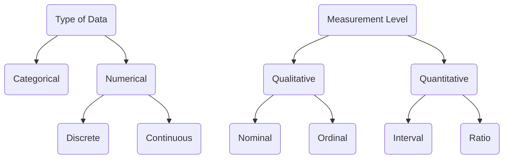

# 统计

## 基础概念

### 总体 & 样本

✏️『 **统计学** 』是对研究对象的数据进行收集、整理、分析和研究，以显示其总体的特征和规律性的科学。

✏️『 **试验单位** experimental unit 』作为数据来源的研究对象。

- 🌰 想要研究学校中的男女生比例，"试验单位" 是每个学生。

✏️『 **变量** variable 』是试验单位身上的特性 characteristic，每个试验单位的变量值可能是不同的。

- 🌰 研究一家店的经营情况，每年的 "销售额"，"开支"，"净利润" 都可以作为变量。每一年这家店的这些变量的值都是变化的。
- 在做研究时，从试验单位身上具体记录下来的变量值，称为『 **测量值** measurement 』，也就是所要分析的『 **数据** data 』。
- 获得一个测量值的过程, 称为『 **试验** experiment 』

::: normal 🌰 例子：

下表中记录 5 个学生的相关信息：

- 『 试验单位 』是每一个学生；
- 『 变量 』分别是 "GPA"，"Gender"，"Year"，"Major"，"Number of Credit Hours"；

:::

✏️『 **总体** population 』是我们感兴趣的研究对象全体。

- 它是由客观存在的、具有某种共同性质的许多个体所构成的整体。
- 构成总体的个体称为『 **总体单位** Unit of Population 』。
- 『 **参数** parameters 』是描述总体特征的数值。

因为调查收集一个总体的数据往往很难，所以通常只会随机地选出总体中一部分的个体进行调查。

::: normal 🌰 例子：

调查一个学校中所有学生的每月花费：

- ❌ 基本上不可能调查完所有的学生。因为学生数量非常多，而且有的学生请假回家了，有的学生去实习了，有的学生去国外交换了。

:::

✏️『 **样本** sample 』是总体中的一个子集。

- 构成样本的个体称为『 **样本单位** Unit of Sample 』。
- 『 **统计量** statistics 』是描述样本特征的数值，是由样本数据计算得到的。

一个好的样本必须具备两种特性：

- 随机性 Randomness: 样本中的每一个个体都是随机从总体中抽出的。
- 代表性 Representativeness: 样本中个体的组成准确地反映出总体中个体的组成结构。

::: normal 🌰 例子：

对于 "调查一个学校中所有学生的每月花费" 这个问题。可以进行抽样，但是样本必须保证 "随机性" 和 "代表性"：

- ❌ "从计算机系随机选出 100 人调查"，其他专业的学生没有机会被选上。
- ❌ "从食堂里随机选 100 人调查"，很多人根本不去食堂吃饭，还有的人根本就不在学校，他们就没有机会被选上。
- ✅ 从学校数据库中找出 "全体学生名单"，随机地选出 100 人。

:::

### 描述性统计 & 推断统计

✏️『 **描述性统计** descriptive statistics 』: consists of procedures used to summarize and describe the important characteristics of a set of measurements.

- 🌰 记录一个工厂过去一年中二氧化碳的每日排放量;

✏️ **进行 "描述性统计" 的基本步骤**：

---

✏️『 **推断统计** inferential statistics 』: consists of procedures used to make inferences about population characteristics from information contained in a sample.

- 🌰 利用一个湖中不同位置采集的水样本, 去推断出整体湖水的性质;

✏️ **进行 "推断统计" 的基本步骤**：

1. **确定想要回答的问题，以及识别出总体**：
   - 总体需要由与问题最相关的 "试验单元" 身上的 "测量值" 组成。也称为『 **Population of Interest** 』
   - 🌰 假如问题是 "总统大选中谁会在选举日获得最多票"。总体是 "所有选票"，而不是 "所有选民"。
2. **确定选取样本的方法**：
   - 这一步也称为『 design of the experiment 』或者『 sampling procedure 』
   - 需要关心的点是，选取出的样本是否具有 "随机性" 和 "代表性"，样本需要有多大才能回答出 Step 1 设定的问题，以及尽可能花最少的时间和金钱。
   - 🌰 例如，魁北克省的选票情况能否代表全加拿大的情况？如何选出可以代表全加拿大选票情况的样本？需要选出多少张？
3. **选出样本，并且对样本进行分析**：
   - 选出样本之后，需要用恰当的分析方法去将样本数据中包含的信息找出来。
4. **通过分析结果，对总体进行推断**：
   - 可以有很多种方法去进行推断。根据问题的不同，数据类型的不同，样本大小的不同，需要选出来最合适的方法。
5. **确认推断结果的可靠度**：
   - 因为搜集来的样本只是总体中的一部分，通过由它计算来的结果去分析总体的特性是会有误差的。
   - 需要确定这种误差大概有多少，是否可以相信推断结果，并拿它去回答 Step 1 设定的问题。

### 数据分类

有两种方式对数据进行分类：

- 『 **数据类型** Type of Data 』
- 『 **度量水平** Meaurement Level 』

#### 数据类型

数据类型分为两种：

✏️『 **分类数据** Categorical Data 』用类别 categories or groups 进行表示的数据：

- 🌰 性别，民族，品牌，季节，颜色，Yes / No。
- 🌰 调查学校中学生是否有车，根据回答可以将学生分为 Yes 或者 No 两组。

---

✏️『 **数值数据** Numerical Data 』可以用数值进行量化表示的数据。更具体又分为：

- 『 **离散数据** Discrete Data 』有限的，可数的数据：

  - 🌰 医院里一天出生的婴儿数量，手机每天的销售量，每个国民的收入。

- 『 **连续数据** Continuous Data 』无限的，不可数的，每时每刻都在连续地变化的数据。
  - 🌰 行驶中的汽车到目的地的距离，人的身高，体重 ( 每时每刻都在变化 )
  - 🌰 以秒为单位计算的时间是 "离散数据"，但是现实中的时间没有一个最小刻度单位，是连续的，不可数的，所以是 "连续数据"。

#### 度量水平

根据度量水平，数据可以分为：

✏️『 **定性数据** Qualitative Data 』用类别进行表示的数据。又可以分为：

- 『 **定类数据** Nominal Data 』类别之间没有顺序关系。
  - 🌰 男女，品牌，血型，颜色，地区，民族；
- 『 **定序 ( 顺序 ) 数据** Ordinal Data 』类别之间有顺序关系。
  - 🌰 学历：小学，初中，高中，大学，研究生。
  - 🌰 喜欢的程度：厌恶，不喜欢，没感觉，喜欢，非常喜欢。

---

✏️『 **定量数据** Quantitative Data 』可以用数值进行量化表示的数据，数值之间是有大小顺序的。又可以分为：

- 『 **定距 ( 区间 ) 尺度** Interval Data 』数值之间具有一定的间隔，这个间隔是等距的。不具有绝对的 $0$ 点。数值之间只能进行加减运算，不能进行乘除运算。

  - 🌰 00:00 并不代表最小的时间。不可以说 10:00 是 00:00 的十倍，只能说比 00:00 晚 10 个小时。
  - 🌰 摄氏温度：-100°C，0°C，100°C。0°C 并不是最小的温度。只能说 100°C 比 0°C 高 100 度。

- 『 **定比尺度** Ratio Data 』具有绝对的 $0$ 点。数值之间既可以进行加减运算，也可以进行乘除运算。
  - 🌰 小王工资 2000 元，小红工资 1000 元。小王比小红多挣 1000 元，小王是小红工资的 2 倍。
  - 🌰 开尔文温度：0K 称为绝对零度，是最小的温度，等于 -273.15°C。这个温度下物体的分子内能为 0。

## 描述性统计

### 用图形描述数据

#### 描述 "Categorical Data" 的图形

#### 描述 "Numerical Data" 的图形

### 数值型描述度量

探索性数据分析

## 概率 & 概率分布

## 参数估计

## 假设检验

## 简单线性回归

## 多元线性回归
