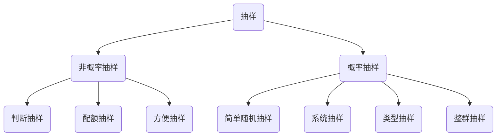

# 概率 & 概率分布

基于样本数据对总体做出的推断是存在一定程度的误差的。而误差有多大是不确定的。

通过计算『 **概率** 』可以度量这种不确定性。

- 🌰 天气预报说, 明天会下雨的可能性为 20%. 这种说法指出明天是否下雨是不确定的, 有 20% 的可能性会下雨。
- 🌰 一个石油公司对一个可能油井进行勘探，10 次都没有检测到石油。虽然勘探检测存在失误的概率，但是 "油井里有油" 可以认为是一个极其不可能的事件。公司决策人可以直接放弃继续勘探。

概率是连接 "描述统计" 和 "推断统计" 的桥梁。

## 概率论基础

### 概率的基本概念

我们通过『 **试验** experiment 』去获得一个『 **测量值** measurement 』也可以称为『 观测值 observation 』

从一次试验中得到的一个基本结果 ( 不能够再分解成任何其他结果的结果 ) ，称为『 **简单事件** simple event 』 用 $E$ 表示。

- 简单事件集合, 称为『 **事件** event 』

一次试验的所有可能得到的 "简单事件" 的集合, 称为『 **样本空间** sample space 』用 $S$ 表示。

如果一个变量，与一个样本空间中的每个简单事件都有对应的变量值 $Y$。那么其称为『 **随机变量** random variable 』

- $Y$ 的每个取值都可以作为一个事件, 其中包含着具有相同 $Y$ 值的简单事件集合;
- 根据随机变量取值的不同，可以分为『 **离散随机变量** discrete 』和『 **连续随机变量** continuous 』
- 随机变量不一定非是 "Quantitative Variable" 的，"Qualitative Variable" 的取值也可以转换为数值。可以给每一个分类制定一个数字。🌰 例如，做扔硬币试验，可以将正面朝上记录为 1，反面朝上记录为 0。

::: normal 🌰 例子：

假如从 240 件商品中随机取出 4 件, 用一个随机变量 $Y$ 表示, 4 件商品中出现残次品的数量. $Y$ 的可能值有 $0, 1, 2, 3, 4$;

- 事件 $Y = 0$ 表示 4 件商品中没有残次品;
- 事件 $Y = 1$ 表示 4 件商品中有一个残次品;
  :::

可以通过『 **文氏图** Venn diagram 』用图来表示样本空间及其简单事件。

- 样本空间呈现为一个封闭的图形。
- 内部用点代表一个简单事件。

::: normal 🌰 例子：

**试验**：投掷一枚骰子，观察朝上的面
**简单事件**：

$E_1$：观测到 1
$E_2$：观测到 2
$E_3$：观测到 3
$E_4$：观测到 4
$E_5$：观测到 5
$E_6$：观测到 6

**样本空间**：$S = \{E_1, E_2, E_3, E_4, E_5, E_6\}$ 或者 $S = \{1, 2, 3, 4, 5, 6\}$

**文氏图**：

:::

另一种表示样本空间的方法是『 **树形图** tree diagram 』，可以清晰的展示涉及多个变量的简单事件组成的样本空间。

::: normal 🌰 例子：

假如要测量一个人的血型 Blood Type 和 Rh factor。用树形图可以清晰的表示所有可能出现的简单事件：

样本空间：

$$S = \{A+, A-, B+, B-, AB+, AB-, O+, O-\}$$
:::

对于涉及两个变量的简单事件，还可以用『 **概率表** probability table 』来表示：

::: normal 🌰 例子：

上面 👆 测血型的各种简单事件，可以用概率表来表示：

:::

#### 概率的基本计算

『 **概率** probability 』是一个数值，代表特定事件发生的可能性。

- 对于一个简单事件 $E$ , 我们记 $E$ 的概率为 $P(E)$
- 一个事件的概率，是事件中包含的所有简单事件概率之和。
- 概率的数值范围在 $0$ 和 $1$ 之间，$0 \le P(E) \le 1$
- 在样本空间中，所有简单事件的概率和为 $1$

有两种方式得到概率：

1. **先验概率** prior probability：对于概率的计算是基于对总体和试验过程的了解。在试验之前，就可以得出每一种简单事件的概率：
   - 🌰 一个装有 25 个红球，25 个黑球的袋子，所有的球均匀的混合在一起。拿出一个黑球的概率为 $P(E_{black}) = 25/50 = 0.5$
2. **经验概率** empirical probability：对于总体并不了解。基于试验得到的观测值去估计事件的概率。认为随着试验次数的增加，计算出的概率也越来越符合总体实际情况。
   - 🌰 在学习调查学生做兼职的情况，随机调查了 $100$ 人发现 $20$ 人有在做兼职。认为学校里大约有 $20\%$ 的学生在做兼职。

::: details-open 🌰 例子：

假设我们同时抛两枚质地均匀的硬币，并且记录正面朝上的面。

用概率表表示所有的简单事件，以及对应的概率：

定义 "事件 A" 为 "只有一枚硬币正面朝上"，计算它的概率为：

$$P(A) = P(E_2) + P(E_3) = \frac{1}{4} + \frac{1}{4} = \frac{1}{2}$$

这个试验的样本空间也可以用 "树形图" 来表示：

:::

### 独立性 & 条件概率

在给定 "事件 B" 发生的条件下, "事件 A" 发生的概率，称为『 **条件概率** conditional probability 』用 $P(A|B)$ 表示。

条件概率公式：

$$P(A|B) = \frac{P(A∩B)}{P(B)}$$

::: details-open 🌰 例子：

假设, 我们投掷一个骰子:

- 事件 A: 投掷出的结果为偶数;
- 事件 B: 投掷出的结果小于等于 3;

:::

如果事件 $B$ 的发生, 不改变事件 $A$ 发生的概率, 我们称事件 $A$ 和事件 $B$ 是『 **独立事件** independent event 』

- 🌰 掷两质地定均匀的硬币，第一枚的结果不会影响第二枚硬币的结果。

对于独立事件，$P(B|A) = P(B)$ 或 $P(A|B) = P(A)$

不独立的事件称为『 **相关事件** dependent event 』

### 事件间的关系

#### 互斥事件 & 完备事件组

如果两个事件不能同时发生，则两个事件是『 **互斥事件** mutually exclusive 』

- 两个互斥事件是『 相关事件 』

『 **完备事件组** Collectively Exhaustive Events 』：

- 设 $S$ 为试验 $E$ 的样本空间，$B_1，B_2，…，B_n$ 为 $E$ 的一组事件。若
  - $B_i ∩ B_j=∅$ （$i≠j$ 且 $i、j=1，2，…，n$）；
  - $B_1∪B_2∪…∪B_n=S$，
- 则称 $B_1，B_2，…，B_n$ 为样本空间 $S$ 的一个完备事件组。

🌰 投掷一枚硬币，得到的正面和反面就是一组 "互斥且完备的" 事件。

#### 补事件

一个事件 A 的『 **补事件** complement 』是指在样本空间中，除事件 A 之外的所有简单事件组成的事件，记作 $A^c$

- 样本空间 $S = A ∪ A^c$
- $P(A) + P(A^c) = 1$

::: details-open 🌰 例子：

:::

#### 并事件

两个事件 A 和 B 的『 **并** union 』是指在一次单独试验中，若 "事件 A 发生 " 或 "事件 B 发生" 或 "事件 A 和 B 同时发生"，它就会发生的一个事件。记作 $A∪B$

可以用『 **加法法则** 』计算 "事件 A" 和 "事件 B"『 并 』的概率，等于 "事件 A" 和 "事件 B" 的概率之和，减去 "事件 A" 和 "事件 B"『 交 』的概率：

$$P(A∪B) = P(A) + P(B) - P(A∩B)$$

::: details-open 🌰 例子：

:::

对于『 互斥事件 』, $A \cap B$ 永远不可能发生, $P(A \cap B) = 0$

#### 交事件

两个事件 A 和 B 的『 **交** intersection 』是指在一次单独试验中，若 "事件 A 和 B 同时发生"，它就会发生的一个事件。记作 $A∩B$

可以根据『 条件概率公式 』推导出『 **乘法法则** 』去计算 "事件 A" 和 "事件 B"『 交 』的概率：

$$P(A∩B) = P(A|B)P(B) = P(B|A)P(A)$$

对于『 独立事件 』可以用『 **独立事件乘法法则** 』去计算 "事件 A" 和 "事件 B"『 交 』的概率：

$$P(A∩B) = P(A)P(B)$$

::: details-open 🌰 例子：

投掷二枚质地均匀的骰子。

- 事件 A 为 "骰子 1 的点数为 6"。
- 事件 B 为 "骰子 2 的点数为 6"。
- 事件 A 和 B 是独立事件，互相不会干扰。

$$P(A∩B) = \frac{1}{6} * \frac{1}{6} = \frac{1}{36} = 0.0278$$
:::

### 计数法则

有时候试验包含太多的简单事件, 以至于不太可能把他们全部列举出来, 这时用『 **计数法则** Counting Rules 』可以数清楚简单事件的个数.

#### 乘法法则

::: details-open 🌰 例子：

:::

#### 排列法则

::: details-open 🌰 例子：

:::

#### 分割法则

::: details-open 🌰 例子：

:::

#### 组合法则

::: details-open 🌰 例子：

:::

### 贝叶斯法则

『 **贝叶斯法则** Bayes's Rule 』是前面的所讲的条件概率的扩展。用于在已知一些条件发生的情况下，求某事件发生的几率。

给定 $k$ 个互斥且完备的事件 $S_1, S_2, ..., S_k$，和一个观测到的事件 $A$：

$$P(A) = P(A∩S_1) + P(A∩S_2) + ... + P(A∩S_n)$$

根据『 乘法法则 』可以推导出：

$$P(A) = P(S_1)P(A|S_1) + P(S_2)P(A|S_2) + ... + P(S_n)P(A|S_n)$$

那么进一步可以推导出：

$$P(S_i|A) = \frac{P(S_i∩A)}{P(A)} = \frac{P(S_i)P(A|S_i)}{P(S_1)P(A|S_1) + P(S_2)P(A|S_2) + ... + P(S_k)P(A|S_k)}$$

在贝叶斯统计中，$P(S_i|A)$ 称为『 **后验概率** Posterior Probability 』是在考虑了相关事件后所得到的条件概率。

::: details-open 🌰 例子：

一家生产点灯的公司，分别在日本，中国，韩国有代工厂。

- 其中，70% 的订单交给中国，20% 的订单交给日本，剩下 10% 的订单交给韩国。
- 中国交付产品的准点率是 95%，日本是 90%，韩国是 85%。

**问题**：请计算出，随意选出一个产品它是准时交付的，并且恰巧是中国生产的概率。

**解答**：

- 定义 "事件 $A$" 为一个产品被准时交付。
- 定义 "事件 $S_1, S_2, S_3$" 分别为产品生产自日本，中国，韩国。
- 用 $P(S_2|A)$ 表示，随意选出一个产品它是准时交付的，并且恰巧是中国生产的概率。

根据已知的信息和贝叶斯法则可以得出：

:::

## 离散随机变量及其概率分布

离散随机变量 $Y$ 的『 **概率分布** probability distribution 』是表示变量 $Y$ 的每个可能取值 $Y = y$ 和其相应概率 $P(y)$ 的表, 图或公式。

- 其反映出来的是在 "总体 population" 中每个变量值的概率分布情况。

::: normal 🌰 例子：

抛两枚硬币，可能出现的简单事件，及其对应的概率和变量值如下表：

用直方图去绘制概率分布：

:::

随机变量 $Y$ 的在总体中的均值，称为『 **期望值** expected value 』用记号 $E(Y)$ 表示;

$$μ = E(Y) = \sum\limits_{所有 y} yp(y)$$

设 $g(Y)$ 是关于 $Y$ 的一个函数, 则 $g(Y)$ 的期望值为:

$$E(g(Y)) = \sum\limits_{所有 y} g(y)p(y)$$

随机变量 $Y$ 的『 **方差的期望值** 』为:

$$\sigma^2 = E[(Y-μ)^2] = E(Y^2) - μ^2$$

随机变量 $Y$ 的『 **标准差的期望值** 』为方差期望值的平方根:

$$\sigma = \sqrt{\sigma^2}$$

::: details-open 🌰 例子：

假设仓库里有 6 种货物，随机拿出一个货物它对应概率分布如下：

根据概率分布计算出来所需要的一些值：

均值的计算：

方差的计算：

标准差的计算：

:::

### 均匀概率分布

当一个样本空间中，每个简单事件出现的几率都相同时，随机变量 $X$ 的概率分布称为『 **均匀概率分布** uniform probability distribution 』

🌰 掷一枚骰子，各个面出现的概率都是相同的，全都为 $1/6$。设随机变量 $x = 1, 2, 3, 4, 5, 6$ 分别代表骰子的各个面，它们的概率分布如下：

### 伯努利试验 & 二项概率分布

如果试验只可以得到两个互斥且完备的结果之一。则该试验称为『 **伯努利试验** Bernoulli 』

- 为了命名方便，用 $S$ ( success ) 表示一个结果，$F$ ( failure ) 表示另一个结果。
- 它们概率分别用 $p$ 和 $q$ 表示，即 $P(S) = p$, $P(F) = q$
- $p+q=1$

🌰 生活中的伯努利试验：

- 抛一枚硬币，看正面朝上的面。
- 掷一枚骰子，看点数是否为 6。
- 射击一个目标，看是否命中。
- 选一个学生，看是男孩还是女孩。

伯努利试验的『 **概率分布** 』为：

$$p(y) = p^yq^{1-y} \quad (y=0,1)$$

- $y=1$ 表示试验成功，$y=0$ 表示试验失败。
- $p$ = 成功的概率，$q = 1-p$

伯努利随机变量的『 **均值** 』和『 **方差** 』分别为：

$$μ = p \qquad \sigma^2 = pq$$

---

由 $n$ 次相同的 "伯努利试验" 组成的试验, 称为『 **二项试验** binomial 』其具备如下性质：

- 关心的随机变量 $x$ 的值是在 $n$ 次试验中成功的次数。
- 每次试验观测的结果都与之前的试验结果相互独立，互不干扰。

根据前面学过的 "组合法则" 可以知道，从 $N$ 个元素里面 $n$ 个元素有如下种选择方式：

$$\begin{pmatrix} N \\ n \end{pmatrix}=\frac{N!}{n!(N-n)!}$$

假设，我们做了 $n$ 试验，$x$ 代表成功的次数，$p$ 代表一次试验中成功的概率。那么二项试验的『 **概率分布** 』如下：

$$P(x) = \frac{n!}{x!(n-x)!} \, p^x(1-p)^{n-x}$$

二项试验的『 **均值** 』和『 **方差** 』分别为：

$$μ = np \qquad \sigma^2 = npq$$

::: details-open 🌰 例子：

抛一枚硬币 10 次，求有 2 次正面朝上的概率。

- $n = 10$
- $p = 0.5$

$$P(X = 2) = \frac{10!}{2!(10-2)!} \,(0.5)^2(1-0.5)^{10-2} = 45 * 0.25 * 0.0039 = 0.0439$$

整个二项试验的概率分布如下：

:::

### 泊松概率分布

『 **泊松随机变量** Possion random variable 』的值表示的是，某个事件在一个给定的单位时间 or 空间内发生的次数。

- 🌰 一个商店一小时内进来顾客的数量。
- 🌰 一个机器在一年内故障的次数。
- 🌰 一个路口十分钟经过汽车的数量。

泊松随机变量的『 **概率分布** 』如下：

$$P(x) = \frac{μ^xe^{-μ}}{x!}$$

- $e$ 是自然常数，等于 $2.71828...$
- $μ$ 是给定单位时间或空间内发生事件的平均数。
- 泊松概率分布的『 **方差** 』等于平均数，$\sigma^2 = μ$

下图展示了不同 $μ$ 值的泊松概率分布直方图：

::: details-open 🌰 例子：

已知某家小杂货店，平均每周售出 2 个水果罐头。请问该店水果罐头的最佳库存量是多少？

$$P(x) = \frac{2^xe^{-2}}{x!}$$

根据公式，计算得到每周销量的分布：

从上表可见，如果存货 4 个罐头，95% 的概率不会缺货；如果存货 5 个罐头，98% 的概率不会缺货。
:::

在『 **二项试验** 』中，当 $n$ 很大，$μ = np$ 很小的时候 ( $np < 7$ ) 『 泊松概率分布 』近似于『 二项概率分布 』。

::: details-open 🌰 例子：

工厂需要从一个制造商订购电子元件。根据以往的经验算出，交付的电子元件的不合格率是 0.001。现在工厂需要订购 1000 件产品。出现 0 件不合格产品的概率是多少？1 件？2 件？3 件？4 件？

购买 1000 件产品的行为可以看作是一个由 1000 次 "伯努利试验" 构成的 "二项试验"，$n=1000$，$p=0.001$。可以算出来 1000 件产品里出现不合格产品的平均数 $μ = np = 1000 * 0.001 = 1$

根据 "泊松概率分布" 可以得出 $p(x) = 1^xe^{-1}/x! = e^{-1}/x!$

进一步可以算出：

- $p(0) = e^{-1}/0! = 0.368/1 = 0.368$
- $p(1) = e^{-1}/1! = 0.368/1 = 0.368$
- $p(2) = e^{-1}/2! = 0.368/2 = 0.184$
- $p(3) = e^{-1}/3! = 0.368/6 = 0.061$
- $p(4) = e^{-1}/4! = 0.368/24 = 0.015$

还可以算出累计概率，1000 件产品中不合格数量不超过 4 件的概率为：

$$p(x \le 4) = p(0) + p(1) + p(2) + p(3) + p(4) = 0.996$$

因为这道题中，$n$ 很大 $μ$ 很小 ( $μ < 7$ ) 所以 "泊松概率分布" 非常近似于 "二项概率分布"。下图 👇 展示了在两种不同分布中，$x$ 值对应的概率。可以看到是非常近似的。

:::

### 负二项概率分布 & 几何概率分布

有时候需要度量某个结果出现前, 需要做的试验次数. 这时, 我们将每次试验看作是只有两种结果: "想要的结果" 和 "不想要的结果" 的伯努利试验。

- 🌰 抽多少次奖券可以中奖。
- 🌰 一个机器在出现故障前，可以使用多少次。
- 🌰 需要调查多少人才可以发现一个 COVID-19 感染者。

随机变量 $Y$ 表示直至观测到第 $r$ 次成功时, 试验的总次数。随机变量的概率分布称为『 **负二项分布** Negative Binomial 』也就是在 $n$ 次伯努利试验中，试验 $y$ 次得到第 $r$ 次成功的机率。

- "二项随机变量" 的值是 $n$ 次试验中，观测到成功的次数 $y$。
- "负二项随机变量" 的值是观测到 $r$ 次成功，所需做的实验的次数 $y$。
- 它们的 "概率分布" 表示出的是，不同的随机变量值 $y$ 对应的概率 $p(y)$。

$$p(y) = \begin{pmatrix} y-1 \\ r-1 \end{pmatrix}p^{r}q^{y-r}$$

- $p$ 为一次伯努利试验成功的概率。
- $q = 1 - p$

负二项随机变量的『 **均值** 』和『 **方差** 』为：

$$\mu =\dfrac{r}{p}\qquad\sigma ^{2}=\dfrac{rq}{p^{2}}$$

---

对于 $r = 1$ 的特殊情况, $Y$ 的概率分布称为『 **几何概率分布** Geometric 』也就是在 $n$ 次伯努利试验中，试验 $y$ 次才得到第 $1$ 次成功的机率。

$$p(y) = pq^{y-1}$$

几何概率分布的『 **均值** 』和『 **方差** 』为：

$$\mu =\dfrac{1}{p}\qquad\sigma ^{2}=\dfrac{q}{p^{2}}$$

::: details-open 🌰 例子：

一个工厂生产电子元器件的不合格率为 10%，现在对一批成品进行逐个的检验，直至发现第一个不合格的产品。

在前 5 次测试中就发现第一个不合格品的概率？

首先 $p=0.1$，$q = 0.9$ 根据几何概率分布可以计算出：

- $p(1) = (0.1)(0.9)^0 = 0.1$
- $p(2) = (0.1)(0.9)^1 = 0.09$
- $p(3) = (0.1)(0.9)^2 = 0.081$
- $p(4) = (0.1)(0.9)^3 = 0.0729$
- $p(5) = (0.1)(0.9)^4 = 0.06561$

$$p(Y \le 5) = p(1) + p(2) + p(3) + p(4) + p(5) = 0.41$$

几何随机变量的均值，方差为：

- $μ = 1/p = 1/0.1 = 10$
- $\sigma^2 = q/p^2 = 0.9/0.1^2 = 90$

平均需要检查 10 个产品，才会发现 1 个不合格的产品。
:::

### 超几何概率分布

当我们从一个结果只能为成功或失败的有限总体中抽取样本时, 如果每次观测完试验结果后：

- 都把试验单元放回总体, 称为『 **有放回抽样** sample with replacement 』每次试验之间都是独立的，互相不干扰。
- 不把试验单元放回, 称为『 **无放回抽样** sample without replacement 』

在 "无放回抽样" 时, 假设总体中有 $N$ 个元素, 我们随机抽取 $n$ 个不同的元素：

- 当 $N$ 很大, 且 $n/N$ 很小, 小于 $0.05$ 时, 得到一个成功的概率大致与其他次试验相同, 则成功次数 $Y$ 的概率分布近似于一个『 二项概率分布 』;
- 当 $n/N$ 大于 $0.05$ 时, 成功次数 $Y$ 的概率分布称作『 **超几何概率分布** hypergeomatric 』

$$p_{y}=\dfrac{\begin{pmatrix} r \\ y \end{pmatrix}\begin{pmatrix} N-r \\ n-y \end{pmatrix}}{\begin{pmatrix} N \\ n \end{pmatrix}}$$

- $N$ 为总体中元素的个数。
- $n$ 为抽取的元素个数。
- $r$ 为总体中代表成功的元素个数。
- $y$ 为抽取的 $n$ 个元素中成功的个数。

超几何概率分布的『 **均值** 』和『 **方差** 』为：

$$\mu =\dfrac{nr}{N} \qquad \sigma ^{2}=\dfrac{r\left( N-r \right) n\left( N-n\right) }{N^{2}\left( N-1\right) }$$

超几何概率分布公式的推到如下：

首先，从包含 $N$ 个元素的总体中选出 $n$ 个元素有 $\begin{pmatrix} N \\ n \end{pmatrix}$ 种选法。

从 $r$ 个成功元素中选 $y$ 个有 $\begin{pmatrix} r \\ y \end{pmatrix}$ 种选法。

总体中失败元素的个数为 $N-r$，选出来的 $n$ 个元素中的失败元素个数为 $n-y$，则有 $\begin{pmatrix} N-r \\ n-y \end{pmatrix}$ 种选法。

$$p(y) = \frac{n 中含有 y 个成功元素的选法}{N 个里面选 n 个元素的选法} = \dfrac{\begin{pmatrix} r \\ y \end{pmatrix}\begin{pmatrix} N-r \\ n-y \end{pmatrix}}{\begin{pmatrix} N \\ n \end{pmatrix}}$$

::: details-open 🌰 例子：

有 12 瓶红酒，其中 3 瓶坏了，从中随机选出 4 瓶。求选中坏瓶的随机概率分布。

- $N = 12$
- $n = 4$
- $r = 3$

$$p(y) = \dfrac{\begin{pmatrix} 3 \\ y \end{pmatrix}\begin{pmatrix} 9 \\ 4-y \end{pmatrix}}{\begin{pmatrix} 12 \\ 4 \end{pmatrix}}$$

不同变量值对应的概率为：

- $p(0) = (1*126/495) = 0.25$
- $p(1) = (3*84/495) = 0.51$
- $p(2) = (3*36/495) = 0.22$
- $p(3) = (1*9/495) = 0.02$

拿到至少一瓶坏酒的概率为 $1-p(0) = 0.75$

均值和方差为：

- $μ = (4 * 3)/12 = 1$
- $\sigma^2 = (3*9*4*8)/(12^2 * 11) = 0.55$
  :::

## 连续随机变量及其概率分布

在实际生活中可以观察到很多『 **连续随机变量** 』, 它们的可能取值的个数是不可数的，可能取值是一个或多个区间中不可数的无穷多个连续的点中的一个。

我们不可能把有限的概率指派给连续随机变量的所有可能的取值。对于任意一个特定的取值，出现的概率都几乎为 $0$。所以需要一个不同于 "离散随机变量" 的方式去表示 "概率分布"。

前面学过，可以连续随机变量的取值范围分出等宽的区间, 计算出测量值落入每个区间的相对概率，然后用 "直方图" 去进行表示。

随着获得的测量值数量越来越多，可以把这个区间的宽度尽可能的缩小, 以至于直方图近似于一条光滑的曲线，称为连续随机变量 $x$ 的『 **概率密度曲线** probability density function 』，用 $f(x)$ 表示。

- 这条曲线下的面积为 $1$。
- $P(a < x < b)$ 等于 $x$ 轴上 $a$ 点和 $b$ 点做垂线与曲线围成的面积。

---

连续随机变量 $x$ 的『 **累积分布函数** Cumulative Distribution Function 』其值等于变量 $x$ 所允许的最小值, 到一个指定的变量 $x$ 的可能取值之间所有可能取值对应的概率之和，用 $F(x)$ 表示。

- $F(x_0) = P(x \le x_0)$
- 对于连续随机变量，其累积分布函数是一个关于变量 $x$ 的 "单调递增连续函数"，若满足 $x_a < x_b$, 则 $F(x_a) \le F(x_b)$

若 $F(x)$ 是连续型随机变量 $X$ 的累积分布函数, 则 $X$ 的密度函数 $f(x)$ 是:

$$f(x) = \frac{dF(x)}{dx}$$
$$F(y) = \int_{-∞}^y f(y)dy$$

### 均匀概率分布

如果连续随机变量 $Y$, 取值在区间 $a \le Y \le b$ 上的密度函数图呈现出如下的一个长方形。这被称为『 **均匀概率分布** uniform 』

均匀随机变量 $x$ 的『 **概率密度函数** 』为：

::: details-open 🌰 例子：

上图 👆 中，求均匀随机变量 $x$ 的值在 $-0.2$ 到 $0.2$ 之间的概率。

$$P(-0.2 < X < 0.2) = [0.2 - (-0.2)] * 1 = 0.4$$
:::

### 指数概率分布

『 **指数分布** Exponential 』描述了某个独立随机事件发生的 "时间间隔" 的概率分布。

- 🌰 婴儿出生的时间间隔;
- 🌰 来电的时间间隔;
- 🌰 网站访问的时间间隔;

指数随机变量 $x$ 的『 **概率密度函数** 』如下：

$$f\left( x\right) =\dfrac{1}{\mu }e^{-x/\mu }$$

- $0 \le x < \infty$，$μ > 0$
- $x$ 表示两次事件发生之间，间隔的单位时间个数。
- $μ$ 表示平均每单位时间发生该事件的次数，也可以用 $λ$ 表示。
- $1/μ$ 表示的是发生 1 次事件平均所需是单位时间个数。

指数随机变量 $x$ 的『 **均值** 』和『 **方差** 』如下：

$$μ = 1/μ \qquad \sigma^2 = 1/μ^2$$

『 **累计分布函数** 』为：

$$F\left( x\right) =1-e^{-μx}$$

- $λ$ 是平均单位时间发生次数，如果 $λ$ 越大，两次间隔时间必然越短. 那么间隔时间大于 $1$ 个单位时间的可能性就越小, 所以曲线也就越陡峭。可以看出 $λ = 1.5$ 的曲线比 $λ = 1$ 的曲线陡多了;

::: details 🌰 例子：

:::

#### 与泊松概率分布的关系

泊松概率分布描述了，在一个给定的单位时间或空间内事件发生的次数及其对应的概率。

$$P(x) = \frac{μ^xe^{-μ}}{x!}$$

在泊松概率分布中，第 $k$ 次随机事件与第 $k+1$ 次随机事件出现的时间间隔服从指数分布。

根据上面的泊松概率分布公式，可以算出在一个单位时间内没有事件出现的概率等于:

$$P(0) = \frac{μ^0e^{-μ}}{0!} = e^{-μ}$$

那么在 $x$ 个单位间内，没有事件出现的概率为：

$$(e^{-μ})^x = e^{-μx}$$

进一步可以推导出，长度为 $x$ 的时间段内有随机事件发生的概率等于 $1$ 减去上面的值，等于指数随机变量的『 累计分布函数 』。

$$1 - e^{-μx}$$

### 正态概率分布

很多随机变量的概率分布呈现出来一个左右对称的 "钟形" 曲线，这种概率分布称为『 **正态概率分布** Normal 』，也称为『 **高斯分布** Gaussian 』

正态随机变量 $x$ 的正态概率分布『 **概率密度函数** 』如下：

$$f(x)=\frac{1}{\sigma \sqrt{2 \pi}} e^{-(x-\mu)^{2} /\left(2 \sigma^{2}\right)}-\infty<x<\infty$$

- $μ$ 和 $\sigma$ 分别是正态随机变量 $x$ 的样本均值和方差。
- 正态分布的密度曲线是关于 $x=μ$ 对称的钟形曲线，即 $x=μ$ 左右两边曲线下的面积相等，且最高点也在 $x=μ$ 处

- 正态分布密度曲线的位置与形状, 由参数 $μ$，$σ$ 唯一确定：
  - 均值 $μ$ 决定了曲线的中心位置。
  - 标准差 $σ$ 决定了曲线的 “胖瘦”。$σ$ 越小，密度曲线越陡峭，变量在均值 $μ$ 附近的取值越集中。 $σ$ 越大，密度曲线则越扁平，变量在均值 $μ$ 附近的取值越分散。

- 定义来讲，正态随机变量 $x$ 的取值可以向横坐标左右两个方向无限延伸，对应的概率密度曲线尾部也无限接近横轴，但永远不会与之相交。
- 现实生活中很难找到取值范围在 $\left( -\infty ,+\infty \right)$ 的随机变量，但是却又很多随机变量的概率分布十分接近于正态分布。所以我们可以用正态分布作为模型去描述这些随机变量。

### 标准正态分布

因为，不同的 $μ$ 和 $σ$ 会使得正态分布曲线的位置与形状也完全不同。可以通过对它们进行『 标准化 standarization 』来转换为全部一样的曲线。

对于随机变量 $x$，它的 $Z$ 得分 $\frac{X-μ}{\sigma}$ 是一个均值为 $0$，方差为 $1$ 的正态随机变量，称为『 **标准正态变量** 』，遵守『 **标准正态分布** standard normal distribution 』

标准正态分布的概率密度函数为：

$$\varphi(x)=\frac{1}{\sqrt{2 \pi}} \mathrm{e}^{-\frac{1}{2} x^{2}}, \quad-\infty<x<\infty$$

可以通过这个 👉 [计算器](https://www.geogebra.org/m/tBeUCc9E) 求得曲线下的面积。

::: details-open 🌰 例子：

假设 $Y$ 是一个均值为 10，标准差为 2.1 的正态分布随机变量。

**问题**：求 $P(7.6 \le Y \le 12.2)$

首先算出来 $Y = 7.6$ 和 $Y = 12.2$ 对应的 $Z$ 得分。

分别是 $Z_1 = (7.6 - 10)/2.1 = -1.14$ 和 $Z_2 = (12.2 - 10)/2.1 = 1.05$

然后求出 $P(7.6 \le Y \le 12.2) = 0.726$

:::

### 判断正态性的描述性方法

可以应用下面 👇 几种描述性的方法来验证样本数据是否来自于一个近似正态分布的总体:

- 建立数据的相对频率直方图或茎叶图，观察图形是否类近似与正态分布。
- 求样本的四分位数间距 $IQR$ 以及标准差 $s$，然后计算$IQR / s$。若数据是近似正态的，则 $IQR/s ≈ 1.3$
- 建立数据的『 **正态概率图** 』，若数据是近似正态的，则点将会近似地落在一条直线上。

🌰 案例：

下表 👇 列出了某种新车型进行 100 次测试获得的行车里程等级数据。请判断它是否符合正态分布？

首先创建数据的相对频率直方图。很明显，行车里程等级是近似丘形的，以约 37 英里/加仑的均值为中心的对称分布。

第二种方法，需要我们求数据集的四分位数间距（ 即第 75 和第 25 百分位数的距离 ）以及标准差，并计算这两个数的比。对于来自于正态分布总体的样本，$IQR/s \le 1.3$。

- 计算求得 $IQR=2.7$ 以及 $s=2.42$
- 所以比为 $IQR/s=2.7/2.42=1.12$ 小于 $1.3$ 所以数据是近似正态的。

的第三种方法是正态概率图。在正态概率图中，按顺序排列数据集中的观测值，然后在数据为正态分布的假定下，关于观测值的 $Z$ 得分作散点图。

- 散点图中，一条轴是排序后的数据值，另一条轴是 $Z$ 得分。
- 正态概率图的线性（ 直线 ）趋势表明数据来自近似的正态分布，而非线性趋势表明数据是非正态分布的.

## 抽样分布

### 抽样方法

样本是从总体中挑选出来用于分析的一部分。我们通过对样本的分析来估计总体的特性 ( parameter ) 为了保证估计的准确性，我们需要让样本尽可能的代表整体总体的情况。

选取的样本的方法叫做『 **抽样方法** sampling plan 』

抽样之前需要先定义『 **样本框** frame 』是指对可以选择作为样本的总体单位进行排序编号，以确定总体的抽样范围和结构。

- 🌰 学生名单表，产品编号表。

定义好样本框之后，就可以在其中进行抽样了。抽样方式大体上可以分为两类：

『 **非概率抽样** nonprobability sample 』

- 不知道样本框中每个个体被抽取的概率。槪率抽样的理论不能在非槪率抽样中应用。
- **优点**：方便，快速，低成本。
- **缺点**：抽样结果可能存在偏差。

『 **概率抽样** probability sample 』

- 样本框中每个个体被抽取的概率都是已知的。
- **优点**：可以得出关于总体的无偏差的推断。
- **缺点**：往往很难实现。

应当尽量采用 "概率抽样"。非槪率抽样仅仅用于大规模调研前的小规模调査。

**只有 "概率抽样" 所得到的样本调查结果能够推论总体**，"非概率抽样" 的样本调查结果是不能推论总体的。

#### 简单随机抽样

在『 **简单随机抽样** simple random sample 』中，每个来自样本框的个体被抽中的槪率都是相等的。而且，每个相同规模的样本被选中的槪率都是一样的。

- 用 $n$ 表示样本容量，$N$ 表示总体样本框。对样本框中每个个体从 $1$ 到 $N$ 标号。第一次选取时，某个数宇被选中的概率是 $1/N$。
- 样本的抽取分有放回和无放回。
- 简单随机抽样是最基本的抽样方法。

有种方法是使用『 **随机数** random number 』来抽取样本。通过计算机可以产生一个『 **随机数表** 』，里面的数是由一组随机产生的数据组成的。

在进行抽样前，首先要把号码与总体中的个体序号对应起来。然后从数据表中随机抽取数字，再去总体中找出对应的单位。以此方式进行随机抽样。

::: details-open 🌰 例子：

**问题**：一家公司的客户名单中包含 1000 个人。现在需要从中随机选出 5 个人，需要使得任意 5 个人被选取的几率都是一样的。

首先给 1000 人进行编号，用号码 1 代表第一个人，以此类推。

然后，在随机数表中，随意选取一个数字作为 "starting point"

从 "starting point" 开始的 5 个数字的前三位分别作为被选取的客户编号。分别是，155，250，032，882，350。

:::

#### 系统抽样

在『 **系统抽样** systematic sample 』中，把样本框中 $N$ 个样本分成 $n$ 组，每组包含 $k$ 个单位。

$$k = \frac{N}{n}$$

最开始，在总体的前 $k$ 个单位中随机抽取一个，之后每隔 $k$ 单位抽取一个，一直抽取到最后可以获得由 $n$ 个单位组成的样本。

::: details-open 🌰 例子：

为了在 $N=8OO$ 个员工的总体中等距抽取 $n = 40$ 的样本，把 $800$ 的总体分成 $40$ 个组，毎个组包含 $20$ 个员工。然后你为前 $20$ 个单位中随机地选择一个数，之后毎隔 $20$ 个抽取一个。

假如，你第一个选取的随机数为 $008$，你的之后的结果依次为 $028, 048, 068, 088，108, ... 768, 788$。

:::

#### 类型抽样

在『 **类型抽样** Stratified random sampling 』中，首先把样本框中的 $N$ 个个体，按照特性分成若干『 **层** strata 』。

- 每一层中的单位具有某些相同的属性。比如性别，年龄，等。
- 在毎层里抽取随机的样本，然后把所有的层的抽样结果组合起来。
- 类型抽样比 "简单随机抽样" 或 "系统抽样" 更有代表性，因为能保证总体中 "具有不同属性的个体" 都能被抽取到。

::: details-open 🌰 例子：

一家公司要在总体为 $800$ 的全职工作者中抽取样本为 $32$ 的员工做调查。在所有全职员工中、有 $25\%$ 是管理者，$75\%$ 是非管理者。你该如何进行类型抽样，以保证抽样结果能正确地代表管理者和非管理者的百分比？

首先要把总体分成两层：第一屋列出的是所有 $200$ 个管理层职工，第二层列出的是 $600$ 个非管理层职员。

为了使类型抽样的结果比例与层大小比例一样，你要在第一层抽取 $25\%$ 的样本，其他的 $75\%$ 在第二层抽取。分别采取两次独立的简单随机抽样。在第一次抽样中，在第一层 $200$ 个管理者中抽取 $10$ 个人，在第二次抽样中，在第二层 $600$ 个样本中随机抽取 $30$ 个非管理层员工。最后把抽样结果组合起来，代表的是整个公司的情况。

:::

#### 整群抽样

在『 **整群抽样** cluster random sampling 』中，把样本框中 $N$ 个个体分成若干个群，毎个群代表总体的情况。接着随机选取一个或一个以上的群，分析所选中群的所有个体情况。

- 应用整群抽样时，要求各群有较好的代表性，即群内各单位的差异要大，群间差异要小。
- 🌰 例如，检验某种零件的质量时，不是逐个抽取零件，而是随机抽若干盒，对所抽各盒零件进行全面检验。
- **优点**：实施方便，高效，节省花费。
- **缺点**：由于不同群之间的差异较大，由此而引起的抽样误差往往大于简单随机抽样。

**分层抽样 vs 整群抽样**：

分层抽样：

- 某公司的雇员按照部门（销售部、市场部、研究部、广告部）分层，在每一个部门随机抽取 10 名雇员。

整群抽样：

- A 城市有 10 家如家连锁酒店，从中随机地选取 5 家，对被选出的每家酒店的全部雇员进行调查。

#### 方便抽样

在『 **方便抽样** convenience sampling 』中，根据选取的方便与否，随意的选取样本。

- 认为被调查总体的每个单位都是相似的，因此把谁选为样本进行调查，其调查结果都是一样的。
- 🌰 在街头路口把行人作为调查对象，任选若干位行人进行访问调查。
- 🌰 在商店柜台前把购买者当做调查对象，向他们中的任意部分人作市场调查。
- **优点**：简单，高效，省钱，省时间。
- **缺点**：如果总体中单位差异较大时，抽样误差也较大。因此，任意抽样法多用于总体情况不甚明了时使用。

#### 判断抽样

『 **判断抽样** judgment sampling 』是指根据调查人员的主观经验从总体样本中选择那些被判断为最能代表总体的单位作样本的抽样方法。

- 当调查人员对自己的研究领域十分熟悉，对调查总体十分了解时采用这种抽样方法，可获代表性较高的样本。
- 这种抽样方法多应用于总体小而内部差异大的情况。
- 🌰 要对福建省旅游市场状况进行调查，有关部门选择厦门、武夷山、泰宁金湖等旅游风景区做为样本调查。
- **优点**：简便易行，操作成本低。
- **缺点**：结果受研究人员的倾向性影响大，一旦主观判断偏差，则根易引起抽样偏差。

#### 配额抽样

『 **配额抽样** Quota Sampling 』是指调查人员将调查总体样本按一定特性分类，确定各类单位的样本数额，在配额内任意抽选样本的抽样方式。

- 配额抽样和分层随机抽样既有相似之处，也有很大区别。它们都事先对总体中所有单位按其特性分类。
- 配额抽样是采用主观判断方法抽取样本，分层抽样是采用等概率原则抽取样本。
- 配额抽样一般适用于总体比较小的研究，抽样建立在研究者对总体非常熟悉的基础上，而分层抽样适用于总体较大的研究，不需要对总体的单位或元素非常熟悉。
  v'p
  ::: details-open 🌰 例子：

假设某高校有 2000 名学生，其中男生占 60％，女生占 40％；文科学生和理科学生各占 50％；一年级学生占 40％，二年级、三年级、四年级学生分别占 30％、20％ 和 10％。现要用定额抽样方法依上述三个变量抽取一个规模为 100 人的样本。

:::

### 调查误差

非概率抽样是会存在误差的，而且即使调査是用概率抽样的，也还是可能存在若一些潜在的误差。有四类调査误差：

『 **涵盖误差** coverage error 』：当某些样本被排除在抽样框之外时，涵盖误差就会发生。因为这些样本没有机会被抽査到。

- 此时无论采用何止抽样方式，通过样本对总体的特性进行估计，都不会得到真正的总体情况。

『 **无回应误差** nonresponse error 』：不是毎个人都愿意参与调査。无回应误差产生于对样本个体数据收集的失败。

- 事实上，研究表明，在经济 "最上层" 或 "最下层" 的民众比起 "中层阶级" 更不愿意参与反馈调査。
- 调査的形式也会影响参与的程度。个人面谈、电话访谈通常比电子邮件调査有较高的参与度，是成本也更髙。

『 **抽样误差** sampling error 』：在进行随机抽样时，从总体中随机抽取的样本，其结构不可能和总体完全一致。由于某些偶然因素的发生，可能使样本不足以代表总体的结构。

- 可以通过增大样本量来减少这种误差，但这同时会增加调査的成本。

『 **测量误差** measurement error 』：是指观测值与真实值之间的差异。

- 🌰 在记录测量值时，调查人员写错了，或者看错了。
- 🌰 在进行问卷调查时，问题表述不清或者有歧义，使得受访者理解错误，给出了错误的回答。或者受访者为了应付调查人员，随便给了个回答。

### 抽样分布

由样本计算而来的数值描述性度量，称为『 统计量 statistic 』因为每次抽取的样本都是随机的，每次计算出的统计量也都可能是不同的。所以，**统计量也是 "随机变量"**。

统计量的概率分布称为『 **抽样分布** sampling distributions 』，它表示出了当从总体中随机抽出一个大小为 $n$ 的样本时，统计量可能取值的概率分布。

::: details-open 🌰 例子：

假设有一个总体包含数字 $3，6，9，12，15$。从中随机抽取 $n=3$ 的样本。计算出样本均值 $\bar{x}$ 和中位数 $m$ 的样本分布。

可能的抽出样本与其对应的统计量如下表所示：

进一步计算出来它们的概率：

绘制出各自的抽样分布：

:::

### 中心极限定理

从一个具有均值和方差的 "任意分布" 的总体中进行随机抽样。当抽样的次数足够大时，样本的均值，方差等统计量的抽样分布近似于 "正态分布"。这被称为『 **中心极限定理** Centeral Limit Theorem，CLT 』

::: details-open 🌰 例子：

骰子上的每一个点数都有 $1/6$ 的几率正面朝上。所有的点数构成的总体，呈现出均匀概率分布。

同时投两枚质地均匀的骰子，然后记录下来正面朝上的点数之和。总共有 36 种可能的组合，每一种出现的概率都是 $1/36$。可以在图中看出，$7$ 出现的次数最多，也就是点数和为 $7$ 的可能性最大，单个骰子的点数均值为 $3.5$ 的可能性最大。

进行很多次试验，可以得出单个骰子点数的均值的抽样分布如下，近似于正态分布。对于其他的统计量也是如此。

:::

### 均值抽样分布

设 $X_1, X_2, ... , X_n$ 为来自均值为 $μ$ 方差为 $\sigma$ 的总体的，具有 $n$ 个观察值的随机样本。那么 $\bar{X}$ 的抽样分布的均值和标准差，记作 $μ_{\bar{x}}$ 和 $\sigma_{\bar{x}}$。

$$\mu_{\bar{x}}=\mu, \sigma_{\bar{x}}=\sigma / \sqrt{n}$$

- 随着 $n$ 的增大，均值的抽样分布的标准差 $\sigma_{\bar{x}}$ 会越来越小。

抽样分布的标准差也被叫做『 **标准误** standard error, SE 』所以 $\bar{x}$ 的正态分布的标准差 $\sigma_{\bar{x}}$ 也可以记作 $SE(\bar{x})$。

根据中心极限定理，我们知道样本均值的抽样分布近似正态分布。所以，为了计算样本均值 $\bar{x}$ 出现的概率，我们需要先将其转换为标准正态分布。

$$z=\frac{\bar{x}-\mu}{\sigma / \sqrt{n}}$$

::: details-open 🌰 例子：

根据研究得出，阿尔兹海默症患者大致可以活 3 至 20 年，平均活 8 年，标准差为 4 年。

现在医院随机选出 30 名患者，求他们从患病后存活时间，平均值小于 7 年的可能性。

$$z=\frac{\bar{x}-\mu}{\sigma / \sqrt{n}}=\frac{7-8}{4 / \sqrt{30}}=\frac{-1}{0.73}=-1.37$$

放入计算器中去计算得到：

$$P(\bar{x}<7)=P(z<-1.37)=0.0853$$

进一步可得出，他们存活时间平均数大于 7 年的可能性为：

$$\begin{aligned}P(\bar{x}>7) &=1-P(\bar{x} \leq 7) \\&=1-0.0853=0.9147\end{aligned}$$
:::

### 比例的抽样分布

在对总体进行抽样分析时，我们经常会定义很多分类变量。🌰 例如，男女，颜色，国家，成绩区间，等等。样本中的个体可以对应到各自的分类之中。

现在，我们聚焦到一个特定的类别之上。🌰 比方说，调查今年销售出的汽车中，"黑色" 汽车的占比。这时，每次从总体中抽出一个销售数据，只可能有两种情况 "是黑色的"，"不是黑色的"。比例抽样分布服从 "二项概率分布"，近似于正态分布。

定义随机变量 $x$ 为样本中符合特定类别的个体数量，$n$ 为样本容量，$\hat{p}$ 为该类别在样本中占比。

$$\hat{p}=\frac{x}{n}$$

比例的标准差计算公式为：

$$\operatorname{SE}(\hat{p})=\sqrt{\frac{p q}{n}}$$

- $p$ 表示总体中该类别个体的占比。
- $q = 1 - p$

::: details-open 🌰 例子：

假设一项研究表明加拿大 12 岁以上人抽烟的比例为 62%。现在随机抽取 100 人，请问其中抽烟人占比低于 0.5 的可能性？

$$\hat{p}=\frac{50}{100}=0.5$$

然后计算出 $Z$ 得分：

$$\begin{aligned}z=& \frac{\hat{p}-p}{\sqrt{\frac{p q}{n}}} \\z=& \frac{0.5-0.62}{\sqrt{\frac{(0.62)(0.38)}{100}}=-2.47}\end{aligned}$$

$$P(\hat{p}<0.5) = p(z<-2.47)=0.0068$$

所以样本中抽烟人占比低于 0.5 的可能性为 $0.68\%$ 是非常低的。
:::
