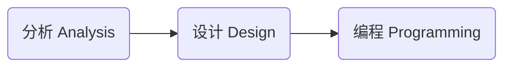

# 面向对象分析 / 设计

## 什么是面向对象

面向对象是一种软件设计思想。

经常拿来与其比较的是『 面向过程 procedural oriented 』

- 想要实现 A 状态到 B 状态，用面向过程思想编码时，会定义出具体的实现步骤。

### Object & Class

面向对象认为程序由一系列对象 Object 组成。 对象可以看作是对现实事物的抽象。一个对象有自己的属性 property 和行为 behavior。

Class 类是对象的定义，是对象的 Template。可以看作是对于同一类对象的抽象。 每一个对象都是 Class 的实例。在 Class 中需要定义对象所具有的属性和行为。

当你用于语言去描述一个软件需要实现的功能时，一般来说，描述中『 名词 none 』就代表着它是一个 Class，关于这个名词的『 动词 verb 』就代表它是这个 Class 的行为 behavior。

使用面向对象思想去开发软件的好处是：

- 让代码的可复用性更高。
- 当项目增大，变复杂时，可以很轻松的直接复用，或者稍加修改之前定义的 Class，就可以实现新的功能。

相较于面向过程：

- 要实现一个新的功能，面向过程的代码就显得比较僵硬，不灵活，可复用性地。

### 抽象，多态，继承，封装

可以简记为 **A-P-I-E** ( A Pie，一个派 )

#### 抽象 Abstraction

对于现实中事物进行概念上的抽象，找出它所具有的属性和方法。

具体定义出哪些属性和方法取决于你的实际需求。

抽象是面向对象语言的核心。

🌰 Person 人：

- 属性：name，age，gender, ...
- 方法：speak，listen，walk，run，...

#### 封装 Encapsulation

对于对象中的一些数据 ( 属性的值 ) 和方法限制外界对其进行访问。

外界只可以访问在一个对象的类中定义的 public 公共方法。通过这些方法，外部可以间接地 "获取 / 更改" 对象的属性值，或者调用对象的私有方法。

这样做的好处有：

- 防止外部设置非法的 invalid 属性值；
- 限制外部去访问一些敏感的数据；
- 使 class 变成一个 "黑箱"，外部只需要调用暴露出的公共方法就可以使用这个类。而不需要，也不能够去管 class 内部的具体实现。
- 降低各个 class 间的依赖。修改一个 class 内部的实现，只要不更改其暴露出的接口，就不会影响到其他的 class。

不同的面向对象编程语言，支持的封装等级都有些区别。但是总的核心思想是，**只暴露必要的接口给外界，只要外界用不到就不暴露**。

#### 继承 Inheritance

在已有的 class 基础之上去创建一个新的 class。新的 class 可以继承其属性和方法。( 具体的继承规则根据语言不同，又各有区别 )

被继承的类称为『 父类 』，继承类称为『 子类 』

父类可以看作是子类的抽象。

#### 多态 Polymorphism

多态的意思就是 "多种形态" ( multiple form )

多态可以分为两种：

**Dynamic 动态多态**：allows us to access methods using the same interface on different types of objects that may implement those methods in different ways.

有很多种方式去实现 "动态多态"：

- Inheritance 继承，Abstract classes 抽象类，Interfaces 接口

使用 "动态多态" 的好处是：

- 不同的对象都同一个接口提供了各自的实现，调用者可以通过在不同对象上调用同一个接口去使用它们各自的行为。

---

**Static 静态多态**： 使用了一个称为『 Overloading 重载 』的特性。重载允许你在一个类中定义具有同样名称的多个方法，它们通过不同的输入参数 input parameter 进行区别。

### 分析 Analysis，设计 Design，编程 Programming

在使用面向对象思想进行软件开发时，会经历如下三个流程：

分析阶段：

- what do you need to do?
- What's the problem you're trying to solve?

设计阶段：

- how you're going to do it.

编程阶段：

- 用代码去具体实现设计。

---

在分析 & 设计阶段，会经历如下五个流程：

1. **Gather Requirements**:
   - what our application needs to do?
   - What problem you are trying to solve?
2. **Describe the application**:
   - Build a narrative in plain, conversational language for how people will use it.
3. **Identify the main objects**:
   - identifying the most important objects
   - understanding each object's responsibilities,
   - the behaviors and properties they need to have
4. **Describe the interactions**:
   - when they interact with other objects.
   - how they interact with other objects.
5. **Create a class diagram**:
   - The class diagram is a visual representation of the classes in the application。
   - It shows what the classes look like, and the relationship between them.
   - It is the main output from the five-step process.

### UML

**UML** 全称 Unified Modeling Language, **统一建模语言**.

- UML 不是一个编程语言。
- It's a graphical notation for drawing diagrams to visualize object oriented systems.
- UML 有一个庞大的体系，但是在面向对象设计时只需要用到几种。
- UML 仅仅是标准的图形化表示法, 它用于对设计和思想进行可视化展现. 如果没有良好的设计能力, 精通 UML 也没有用。

## 需求

分析 & 设计阶段的第一步是 **Gather Requirements 需求收集**。也就是搞清楚：

- what your application or product needs to do.
- What's the problem you're trying to solve?

客户给出的需求可能是很模糊不清的，作为开发者需要弄清楚项目真正的需求是什么。

需求可以分为两种：

- **Functional requirements**：What are the necessary features and capabilities?
  - 使用 must do 短语去描述。
- **Non-functional requirements**：how the application should function.
  - 使用 should be 短语去描述。

### FURPS+

**FURPS+** 是一个更系统的化的需求分类方式：

- **功能性**（ Functional ）: 特性、功能、安全性；
  - 软件的核心功能。
- **可用性**（ Usability ）: 人性化因素、帮助、文档；
  - Usability affects the person who will be using the program. Is it easy on the eyes? Is it intuitive to use? Is the documentation accurate and complete?
- **可靠性**（ Reliability ）: 故障频率、可恢复性、可预测性；
- **性能**（ Performance ）: 响应时间、吞吐量、准确性、有效性、资源利用率；
- **可支持性**（ Supportability ）: 适应性、可维护性、国际化、可配置性。

FURPS+ 中的 `+` 是指一些额外的约束：

- **设计**（ Design ）：constraints on how the software must be built；
- **实现**（ Implementation ）: 资源限制、语言和工具、硬件等；
- **接口**（ Interface ）: external system that needs to be interfaced with；
- **物理**（ Physical ）: 硬件设备的限制；

### 🌰 Jukebox 自动唱机需求分析

The juke box should let a user select an album from the available music library, and then choose individual songs from that album to be played. And as an extra precaution, if one user adds more than three songs in a row to the play queue, and another user wants to play a song, they'll jump ahead in line.

#### Functional

#### Non-Functional

## 用例

在定义完需求之后，让我们接着定义 "用户如何去使用这个软件"。

『 **用例** use case 』是文本形式的情节描述, 用以说明参与者 Actor 如何使用软件去实现目标的情节 Story。

### 参与者, 场景

在编写用例时『 参与者 Actor 』和『 场景 Scenario 』是两个重要的概念：

**参与者 Actor**:

- 任何会与系统产生交互的东西;
- 🌰 人, 计算机系统, 组织, etc;
- 🌰 结账系统: 收银员, 经理;
- 🌰 网络协议栈: 运输层, 网络层, etc;

**场景 Scenario**:

- 参与者与系统之间一系类特定的活动和交互;
- 一个用例就是一组相关的成功或失败场景的集合;
- 🌰 使用现金成功购买商品的场景;
- 🌰 信用卡付款被拒, 造成购买失败的场景;

**参与者的三种类型**：

- **主要参与者 primary actor**: 系统的主要用户。
  - 🌰 收银员, 使用收银系统来处理顾客购物支付.
- **协助参与者 supporting actor**: 为系统提供服务;
  - 🌰 自动付费授权系统, 用户认证登录系统;
- **幕后参与者 offstage actor**: 在用例行为中具有影响, 但不是主要或协助参与者;
  - 🌰 政府税收机构, 从收银系统的流水中确定税收金额;

### 用例的三种常用形式

#### 摘要 brief

简洁的一段式概要, 通常用于主成功场景;

::: details-open 🌰 例子：处理销售

顾客携带所购商品到收银台, 收银台使用 POS 系统记录每件商品. 系统连续显示累计总额, 并逐行显示明细. 顾客输入支付信息, 系统对支付信息进行验证和记录. 系统更新库存信息. 顾客从系统得到购物小票, 然后携带商品离开.
:::

#### 非正式 casual

非正式的段落, 用来描述不同的场景;

::: details-open 🌰 例子：

:::

#### 详述 fully dressed

以结构化的方式, 详细编写所有的步骤及各种变化 ( 分支 ) , 同时具有补充部分, 如前置条件和成功保证;

详述风格用例中的各部分名称, 及其意义:

- **范围 scope**：界定了所要设计的系统 / 业务;
- **级别 level**：
  - 用户目标级别 user-goal level: 描述了实现主要参与者目标的的场景;
  - 子功能级别 subfunction level: 描述支持用户目标所需的子步骤。通常一个子步骤可能在多个用例中都被使用到, 所以单独定义;
- **主要参与者 primary actor**：调用系统服务来完成目标的主要参与者;
- **涉众及其关注点列表 stakeholders and interests**：与这个系统相关的所有人, 以及他们希望这个系统能够给他们带来的好处;
- **前置条件 & 成功保证 ( 后置条件 ) preconditions & success guarantee**：
  - 前置条件: 用例在开始之前必须为真的条件;
  - 后置条件: 用例成功结束后必须为真的条件;
- **主成功场景 main success scenario**：描述了满足涉众关注点的最主要的成功路径。不包含任何条件或分支, 所有的条件处理都推延到扩展部分;
- **扩展 extensions**：描述了其他所有场景或分支;
  - 因为扩展场景是主成功场景的分支, 所以用主成功场景中对应的步骤编号 $1..N$ 对扩展场景进行标识;
  - 🌰 在主成功场景的第 `3` 步, 出现了多条分支路径, 那么对应的第一个扩展被标记为 `3a`, 第二个扩展被标记为 `3b`, 以此类推;
- **特殊需求 special requirements**：包含于用例相关的 "非功能性需求" 和 "设计约束";
- **技术 & 数据变元表 technology & data variations list**：关于如何实现系统的技术性约束;

::: details 🌰 例子：

:::

### 编写用例的一些准则

**编写步骤**：

- 先开始定义出 "参与者 - 目标" 列表；
- 之后以 "摘要 brief" 的形式编写大部分最重要的, 复杂的, 具有风险的用例；
- 之后再以 "详述 fully dressed" 的形式编写其中 10% 代表系统核心功能, 关乎系统核心架构的用例；
- 在完成了这些用例之后，再继续以 "详述 fully dressed" 的形式往后编写；

**尽量保持用例描述的简洁**：

- 应当尽量抛出不必要的词汇；

**编写黑盒用例**：

- 不对系统内部具体的设计, 工作原理进行描述；
- 它只描述系统的 "职责", 也就是描述系统 "能够做" 什么, 而不是 "怎么做";

**关注系统的参与者**：

- 用例中的每个场景执行完的结果, 应该是对参与者有价值的；
- 如果系统不能满足参与者所需, 那就是失败的；

## Domain Modeling 领域模型

在完成了 Analysis 阶段后，我们接下来就进入 Design 阶段了。

让我们先开始『 **领域模型** Domain Modeling 』的创建。

- 需要辨识出软件所涉及的对象 Objects，以及它们的关系，和各个 Objects 各自的职责。

**Identifying the objects**：

- 从编写的用例中找出所有的 "名词"，它们是潜在的对象 Objects。
- 合并一些概念上相同的名词，去掉一些可能做为对象的 properties 存在的名词。

**Identifying class relationships**

- 找出有关联的对象，用直线连接它们。
- 在直线上用一个短语去描述这种关系。
- 并且标上对象之间的数量关系。

**Identifying class responsibilities**

- 之后让我们在用例中找出与名词相关的 "动词"，它们是相关对象潜在的行为 behavior。
- 要注意，根据 "封装" 的理念，一个对象不可以直接更改另外一个对象内部的数据。用例描述中的动词经常表达的这种 "主动修改" 的意思。我们需要辨识出究竟哪些对象应该具有这些行为 ( 职责 )
- 对于每一动词都问一句，whose responsibility is it? Remember that an object should be responsible for itself.
- 🌰 Player 驾驶 Spaceship 去 move，Player 只是 move 动作的触发者，真正执行 move 行为的是 Spaceship。

## Class Diagram

接下来用 UML 去表示领域模型。

### 画出类图

**UML 类图**的格式如下：

根据 "封装" 的理念，我们只向外界暴露必要的接口。

- 用 `-` 表示私有方法和属性；
- 用 `+` 表示公共方法和属性；

之后你可以按照类图去初步编写对应代码：

编写构造函数：

找出来其中与实例对象无关的，静态 `static` 属性和方法：

### 类之间的关系

#### Inheritance 继承

**Inheritance 继承**：**is-a** relationship

#### Aggregation 聚合

**Aggregation 聚合**：**has-a** or **has-many** relationship

- 使用 "空心菱形" 去表示。
- 两个对象之间是独立的关系。

#### Composition 组合

**Composition 组合**：**owns-a** relationship

- 使用 "实心菱形" 去表示。
- 部分是组成整体的一部分，部分不可以在外部独立存在，部分和整体是共存亡的关系。
- 部分在整体内部被实例化。

## 软件开发

### 设计原则

#### S-O-L-I-D

**单一职责原则 Single Responsibility Principle**：

- 一个对象应该只包含单一的职责，并且该职责被完整地封装在一个类中。
- 之所这样，是为了防止当一个类中既有职责 A 又有职责 B 时，当修改职责 A 相关的代码时，因为某些原因导致职责 B 出现异常的可能性。

**开放/关闭原则 Open/Closed Principle**：

- 应该对扩展是开放的，对修改是封闭的。

**里氏替换原则 Liskov Substitution Principle**：

- 一个对象在其出现的任何地方，都可以用子类实例做替换，并且不会导致程序的错误。这种继承关系才是合理的。

**接口隔离原则 Interface Segregation Principle**：

- 不应该让一个类依赖它不使用的方法。
- 如果一个类实现的接口中，包含了它不需要的方法。就需要接口拆分成更小和更具体的接口，有助于解耦，从而更容易重构、更改。

**依赖反转原则 Dependency Inversion Principle**：

- 高层次的模块不应该依赖于低层次的模块，两者都应该依赖于抽象接口。
- 抽象接口不应该依赖于具体实现。而具体实现则应该依赖于抽象接口。

---

SOLID 原则之间并不是相互孤立的，彼此间存在着一定关联，一个原则可以是另一个原则的加强或基础.违反其中的某一个原则，可能同时违反了其他原则。其中，

- 开闭原则和里氏替换原则是**设计目标**；
- 单一职责原则、接口分隔原则和依赖倒置原则是**设计方法**。

#### DRY

DRY 的意思是 Don't Repeat Yourself

- 指在程序设计和计算中避免重复代码；
- 系统的每一个功能都应该有唯一的实现；
- 如果多次遇到同样的问题，就应该抽象出一个共同的解决方法，不要重复开发同样的功能。

#### YAGNI

YAGNI 的意思是 You Ain't Gonna Need It

- 是指你自以为有用的功能，实际上都是用不到的。
- Some programmers fall into is trying to make their code too extensible, and adding hooks for every possible variation of everything they could ever possibly see. Abstraction is good, and we want to be able to extend our programs, but abstracting too much will mean more testing, more debugging, and code bloat.
- 除了核心的功能之外，其他的功能一概不要提前设计，这样可以大大加快开发进程。

#### Rule of Three

你会发现 DRY 原则和 YAGNI 原则是不兼容的。前者追求“抽象化”，要求找到通用的解决方法；后者追求“快和省”，意味着不要把精力放在抽象化上面，因为很可能“你不会需要它”。因此，就有了 Rule of Three 原则。

Rule of Three 也被称为“三次原则”，是指当某个功能第三次出现时，就有必要进行“抽象化”了。

### 软件测试

如果一个东西的使用需要任何外部输入，或者需要配置任何可选项。我们都要假设，用户会用错误的方式使用它。

### 设计模式

设计模式，the re-usable form of a solution to a design problem.

