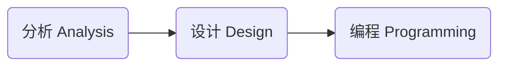

# 面向对象分析 / 设计

## 什么是面向对象

面向对象是一种软件设计思想。

经常拿来与其比较的是『 面向过程 procedural oriented 』

- 想要实现 A 状态到 B 状态，用面向过程思想编码时，会定义出具体的实现步骤。

### Object & Class

面向对象认为程序由一系列对象 Object 组成。 对象可以看作是对现实事物的抽象。一个对象有自己的属性 property 和行为 behavior。

Class 类是对象的定义，是对象的 Template。可以看作是对于同一类对象的抽象。 每一个对象都是 Class 的实例。在 Class 中需要定义对象所具有的属性和行为。

当你用于语言去描述一个软件需要实现的功能时，一般来说，描述中『 名词 none 』就代表着它是一个 Class，关于这个名词的『 动词 verb 』就代表它是这个 Class 的行为 behavior。

使用面向对象思想去开发软件的好处是：

- 让代码的可复用性更高。
- 当项目增大，变复杂时，可以很轻松的直接复用，或者稍加修改之前定义的 Class，就可以实现新的功能。

相较于面向过程：

- 要实现一个新的功能，面向过程的代码就显得比较僵硬，不灵活，可复用性地。

### 抽象，多态，继承，封装


可以简记为 **A-P-I-E** ( A Pie，一个派 )

#### 抽象 Abstraction

对于现实中事物进行概念上的抽象，找出它所具有的属性和方法。

具体定义出哪些属性和方法取决于你的实际需求。

抽象是面向对象语言的核心。

🌰 Person 人：

- 属性：name，age，gender, ...
- 方法：speak，listen，walk，run，...

#### 封装 Encapsulation

对于对象中的一些数据 ( 属性的值 ) 和方法限制外界对其进行访问。

外界只可以访问在一个对象的类中定义的 public 公共方法。通过这些方法，外部可以间接地 "获取 / 更改" 对象的属性值，或者调用对象的私有方法。

这样做的好处有：

- 防止外部设置非法的 invalid 属性值；
- 限制外部去访问一些敏感的数据；
- 使 class 变成一个 "黑箱"，外部只需要调用暴露出的公共方法就可以使用这个类。而不需要，也不能够去管 class 内部的具体实现。
- 降低各个 class 间的依赖。修改一个 class 内部的实现，只要不更改其暴露出的接口，就不会影响到其他的 class。

不同的面向对象编程语言，支持的封装等级都有些区别。但是总的核心思想是，**只暴露必要的接口给外界，只要外界用不到就不暴露**。

#### 继承 Inheritance

在已有的 class 基础之上去创建一个新的 class。新的 class 可以继承其属性和方法。( 具体的继承规则根据语言不同，又各有区别 )

被继承的类称为『 父类 』，继承类称为『 子类 』

父类可以看作是子类的抽象。

#### 多态 Polymorphism

多态的意思就是 "多种形态" ( multiple form )

多态可以分为两种：

**Dynamic 动态多态**：allows us to access methods using the same interface on different types of objects that may implement those methods in different ways.

有很多种方式去实现 "动态多态"：

- Inheritance 继承，Abstract classes 抽象类，Interfaces 接口

使用 "动态多态" 的好处是：

- 不同的对象都同一个接口提供了各自的实现，调用者可以通过在不同对象上调用同一个接口去使用它们各自的行为。

---

**Static 静态多态**： 使用了一个称为『 Overloading 重载 』的特性。重载允许你在一个类中定义具有同样名称的多个方法，它们通过不同的输入参数 input parameter 进行区别。

### 分析 Analysis，设计 Design，编程 Programming

在使用面向对象思想进行软件开发时，会经历如下三个流程：



分析阶段：

- what do you need to do?
- What's the problem you're trying to solve?

设计阶段：

- how you're going to do it.

编程阶段：

- 用代码去具体实现设计。

---

在分析 & 设计阶段，会经历如下五个流程：

1. **Gather Requirements**:
   - what our application needs to do?
   - What problem you are trying to solve?
2. **Describe the application**:
   - Build a narrative in plain, conversational language for how people will use it.
3. **Identify the main objects**:
   - identifying the most important objects
   - understanding each object's responsibilities,
   - the behaviors and properties they need to have
4. **Describe the interactions**:
   - when they interact with other objects.
   - how they interact with other objects.
5. **Create a class diagram**:
   - The class diagram is a visual representation of the classes in the application。
   - It shows what the classes look like, and the relationship between them.
   - It is the main output from the five-step process.

### UML

**UML** 全称 Unified Modeling Language, **统一建模语言**.

- UML 不是一个编程语言。
- It's a graphical notation for drawing diagrams to visualize object oriented systems.
- UML 有一个庞大的体系，但是在面向对象设计时只需要用到几种。
- UML 仅仅是标准的图形化表示法, 它用于对设计和思想进行可视化展现. 如果没有良好的设计能力, 精通 UML 也没有用。

## 需求收集

分析 & 设计阶段的第一步是 **Gather Requirements 需求收集**。也就是搞清楚：

- what your application or product needs to do.
- What's the problem you're trying to solve?

客户给出的需求可能是很模糊不清的，作为开发者需要弄清楚项目真正的需求是什么。

### Functional & Non-functional

需求可以分为两种：

- **Functional requirements**：What are the necessary features and capabilities?
  - 使用 must do 短语去描述。
- **Non-functional requirements**：how the application should function.
  - 使用 should be 短语去描述。

### FURPS+

**FURPS+** 是一个更系统的化的需求分类方式：

- **功能性**（ Functional ）: 特性、功能、安全性；
  - 软件的核心功能。
- **可用性**（ Usability ）: 人性化因素、帮助、文档；
  - Usability affects the person who will be using the program. Is it easy on the eyes? Is it intuitive to use? Is the documentation accurate and complete?
- **可靠性**（ Reliability ）: 故障频率、可恢复性、可预测性；
- **性能**（ Performance ）: 响应时间、吞吐量、准确性、有效性、资源利用率；
- **可支持性**（ Supportability ）: 适应性、可维护性、国际化、可配置性。

FURPS+ 中的 `+` 是指一些额外的约束：

- **设计**（ Design ）：constraints on how the software must be built；
- **实现**（ Implementation ）: 资源限制、语言和工具、硬件等；
- **接口**（ Interface ）: external system that needs to be interfaced with；
- **物理**（ Physical ）: 硬件设备的限制；

### 🌰 Jukebox 自动唱机需求分析

The juke box should let a user select an album from the available music library, and then choose individual songs from that album to be played. And as an extra precaution, if one user adds more than three songs in a row to the play queue, and another user wants to play a song, they'll jump ahead in line.

#### Functional


#### Non-Functional


## 定义用例

在定义完需求之后，让我们接着定义 "用户如何去使用这个软件"。

『 **用例** use case 』是文本形式的情节描述, 用以说明参与者 Actor 如何使用软件去实现目标的情节 Story。

### 参与者, 场景

在编写用例时『 参与者 Actor 』和『 场景 Scenario 』是两个重要的概念：

**参与者 Actor**:

- 任何会与系统产生交互的东西;
- 🌰 人, 计算机系统, 组织, etc;
- 🌰 结账系统: 收银员, 经理;
- 🌰 网络协议栈: 运输层, 网络层, etc;

**场景 Scenario**:

- 参与者与系统之间一系类特定的活动和交互;
- 一个用例就是一组相关的成功或失败场景的集合;
- 🌰 使用现金成功购买商品的场景;
- 🌰 信用卡付款被拒, 造成购买失败的场景;

**参与者的三种类型**：

- **主要参与者 primary actor**: 系统的主要用户。
  - 🌰 收银员, 使用收银系统来处理顾客购物支付.
- **协助参与者 supporting actor**: 为系统提供服务;
  - 🌰 自动付费授权系统, 用户认证登录系统;
- **幕后参与者 offstage actor**: 在用例行为中具有影响, 但不是主要或协助参与者;
  - 🌰 政府税收机构, 从收银系统的流水中确定税收金额;

### 如何发现用例

为满足主要参与者的目标而定义用例, 基本过程如下:

**1 - 选择系统边界**:

定义什么东西在系统之外, 什么在系统之内.

如果对系统边界定义不清, 可以先定义外部的 "主要参与者" 和 "协助参与者", 然后再去定义系统边界.

**2 & 3 - 确定参与者和目标**:

系统是服务于参与者以实现其目标的, 用例描述了这个过程。

应当首先定义「 主要参与者 」及其目标。这样可以先搭建起一个整体框架。

可以通过问以下问题, 来寻找参与者和目标:

- 系统主要是为谁服务的，希望实现它的什么目标？
- 谁来启动 / 停止系统？
- 时间是参与者吗？系统中是否存在某些活动需要去响应时间事件？
- 谁来完成用户管理 / 安全管理 / 系统管理？
- 谁来检测系统活动 & 性能 & 日志？
- 系统发生错误时应该通知谁？
- 有没有其他外部的软件或系统会调用该系统的服务？

写出「 参与者 - 目标 」列表：


系统边界不同, 主要参与者和目标也不同:


- 🌰 例如, "POS 系统" 的主要服务于 "收银员", 而不是 "顾客". 所以主要参与者是 "收银员".

画出「 UML 用例图 」以可视化的方式, 描述外部参与者对系统的使用：

- 用例图中，只表现「 用户目标级别 」的用例，也就是主要参与者的目标。


**4 - 定义用例**:

为每个「 用户目标 」分别定义用例. 用例的名称形容了用户目标, 以动词开头。

- 🌰 目标: 处理销售; 用例: 处理销售;

对于分散的 CRUD ( 创建, 提取, 更新, 删除 ) 目标, 可以合并成一个用例, 一般称为 "管理 XXX"。

- 🌰 例如, "管理用户" 用例, 可以同时满足 "编辑用户", "创建用户", "删除用户" 等目标.

### 用例的三种表述形式

#### 摘要 brief

简洁的一段式概要, 通常用于主成功场景;

::: details-open 🌰 例子：处理销售

顾客携带所购商品到收银台, 收银台使用 POS 系统记录每件商品. 系统连续显示累计总额, 并逐行显示明细. 顾客输入支付信息, 系统对支付信息进行验证和记录. 系统更新库存信息. 顾客从系统得到购物小票, 然后携带商品离开.
:::

#### 非正式 casual

非正式的段落, 用来描述不同的场景;

::: details-open 🌰 例子：


:::

#### 详述 fully dressed

以结构化的方式, 详细编写所有的步骤及各种变化 ( 分支 ) , 同时具有补充部分, 如前置条件和成功保证;

详述风格用例中的各部分名称, 及其意义:

- **范围 scope**：界定了所要设计的系统 / 业务;
- **级别 level**：
  - 用户目标级别 user-goal level: 描述了实现主要参与者目标的的场景;
  - 子功能级别 subfunction level: 描述支持用户目标所需的子步骤。通常一个子步骤可能在多个用例中都被使用到, 所以单独定义;
- **主要参与者 primary actor**：调用系统服务来完成目标的主要参与者;
- **涉众及其关注点列表 stakeholders and interests**：与这个系统相关的所有人, 以及他们希望这个系统能够给他们带来的好处;
- **前置条件 & 成功保证 ( 后置条件 ) preconditions & success guarantee**：
  - 前置条件: 用例在开始之前必须为真的条件;
  - 后置条件: 用例成功结束后必须为真的条件;
- **主成功场景 main success scenario**：描述了满足涉众关注点的最主要的成功路径。不包含任何条件或分支, 所有的条件处理都推延到扩展部分;
- **扩展 extensions**：描述了其他所有场景或分支;
  - 因为扩展场景是主成功场景的分支, 所以用主成功场景中对应的步骤编号 $1..N$ 对扩展场景进行标识;
  - 🌰 在主成功场景的第 `3` 步, 出现了多条分支路径, 那么对应的第一个扩展被标记为 `3a`, 第二个扩展被标记为 `3b`, 以此类推;
- **特殊需求 special requirements**：包含于用例相关的 "非功能性需求" 和 "设计约束";
- **技术 & 数据变元表 technology & data variations list**：关于如何实现系统的技术性约束;

::: details 🌰 例子：


:::

### 编写用例的一些准则

**用例描述应与实现无关 & 尽量简洁**：

- 抛除具体实现细节, 只集中于用户真实意图。这种用例编写风格叫做『 **本质风格** Essential 』与之相对的是『 **具体风格** Concrete 』;
- 尽量抛出不必要的词汇；


**编写黑盒用例**：

- 不对系统内部具体的设计, 工作原理进行描述；
- 它只描述系统的 "职责", 也就是描述系统 "能够做" 什么, 而不是 "怎么做";


**关注系统的参与者**：

- 用例中的每个场景执行完的结果, 应该是对参与者有价值的；
- 如果系统不能满足参与者所需, 那就是失败的；

## Domain Modeling 领域模型

在定义好「 用例 」之后。让我们先开始『 **领域模型** Domain Modeling 』的创建。

- **领域模型是对现实世界事物，概念上的抽象表示**。
- 它将前面定义的业务领域中涉及到的各种事物，抽象定义成「 **概念类** 」并且定义概念类之间的关系。
- 通过领域模型, 团队可以在具体开发之前, 对整个项目的涉及的关键概念, 核心业务有一个整体且简化的了解. 并且领域模型可以一直作为参考在项目的各个阶段被使用, 便于团队间沟通和理解。
- 通过 UML 中的「 类图 Class Diagram 」来表示领域模型。

### 找出概念类

- 从编写的用例中找出所有的「 **名词** 」，它们是潜在的概念类或属性。
- 要注意，自然语言并不精确, 不用的名词短语可能指的是同一个概念类或属性, 还可能有歧义。在定义概念类时要仔细区别。


#### 不要把概念类和属性弄混

不要把应该是「 概念类 」的事物表示为「 属性 」

如果我们**认为某个东西不能用字面量的值 ( 数字, 文本 ) 来表示, 那么它应该是**「 **概念类** 」. 反之就是「 属性 」


**Identifying class relationships**

- 找出有关联的对象，用直线连接它们。
- 在直线上用一个短语去描述这种关系。
- 并且标上对象之间的数量关系。


『 **多重性** multiplicity 』定义了类 A 有多少个实例可以和类 B 的一个实例关联。


**Identifying class responsibilities**

- 之后让我们在用例中找出与名词相关的 "动词"，它们是相关对象潜在的行为 behavior。
- 要注意，根据 "封装" 的理念，一个对象不可以直接更改另外一个对象内部的数据。用例描述中的动词经常表达的这种 "主动修改" 的意思。我们需要辨识出究竟哪些对象应该具有这些行为 ( 职责 )
- 对于每一动词都问一句，whose responsibility is it? Remember that an object should be responsible for itself.
- 🌰 Player 驾驶 Spaceship 去 move，Player 只是 move 动作的触发者，真正执行 move 行为的是 Spaceship。


## 系统顺序图

用例描述了外部参与者如何与我们希望创建的系统进行交互的. 交互中, 参与者触发了『 **系统事件** system event 』, 系统会通过一些『 **系统操作** system operation 』来对这些事件进行处理。

在『 **系统顺序图** System Sequence Diagram 』中我们将系统视为「 黑盒 」。在图中，表现出系统可以通过「 系统操作 」处理参与者发起的「 系统事件 」, 但是不说如何处理的;


系统事件的名称一般以「 **动词** 」开始。应该表达「 **操作的意图** 」, 而不是具体的实现。

- `enterItem(itemId)` 要好于 `scan (itemId)`。因为这个操作的目的是把商品的 ID 输入到系统中, 而具体使用什么设备 ( 扫描仪, 键盘, 语音输入 ... ) 我是不管的。

---

下图展示了「 用例 」与「 系统顺序图 」的对应关系：


## 操作契约

在「 系统顺序图 」中，我们只是表示出参与者触发「 系统事件 」和「 系统操作 」之间的关系。有时候我们需要定义『 **操作契约** Operation Contracts 』对「 系统操作 」进行更为详细和精确的描述。

在编写完了「 系统顺序图 」后, 如果觉得「 系统操作 」太复杂, 其执行后的结果在图中表示不出, 或者在用例中描述的不清楚, 则可以为其构造契约.

操作契约使用『 **前置条件** Pre-Conditions 』和『 **后置条件** Post-Conditions 』, **描述了系统操作被调用前后, 领域模型里对象的状态变化**。

- 前置条件：执行操作之前，对系统或领域模型对象状态的重要假设。
- 后置条件：描述了操作结束后，领域模型内对象的状态，包括创建实例，形成或消除关联，以及属性值的改变。

记住，前置条件和后置条件描述的是领域模型中的对象的状态，所有，**在编写上应该使用描述状态的语句**，而不是指令式的语句。

- 较好："创建了 XXX"
- 较差："创建 XXX" 或 "XXX 被创建"

::: details-open 🌰 例子：

:::

## 对象设计

下面我们由面向「 分析 」的工作过渡到「 软件设计 」工作.

我们需要开始设计真正在软件中要使用的对象 Object 了。

『 **对象模型** Object Model 』由两种类型:

- **动态模型**: 用于表示对象之间的交互。用「 UML 交互图 」表达。
- **静态模型**: 用于表示对象所具有的名称，属性，方法。用「 UML 类图 」表达;


**在绘制时**「 **动态模型** 」**要优先与**「 **静态模型** 」。因为具体系统需要哪些对象, 对象具备哪些方法, 在绘制动态模型时才能准确的落实。

### UML 交互图绘制「 动态模型 」

『 **UML 交互图** Interaction Diagram 』用以描述对象间通过「 **消息** 」进行交互。具体可以使用「 顺序图 Sequence Diagram 」和「 通信图 Communication Diagram 」来表示。这里主要介绍『 **UML 顺序图** 』

> A **message** is an element in a Unified Modeling Language (UML) diagram that defines a specific kind of communication between instances in an interaction. A message conveys information from one instance to another instance in an interaction.

下图 👇 是代码与顺序图之间的对应关系：


#### UML 顺序图的基本表示法

用『 **生命线框图** Lifeline Box 』来表示参与者, 在软件系统中表示为类的实例。


---

在两个生命线框图之间的垂直的生命线上用「 **带实心箭头的实线** 」并附以「 **消息表达式** 」的方式来表示对象间的『 **消息** 』。生命线自上而下表示时间顺序。


『 **消息表达式** 』的通用语法如下：

```java
return = message(parameter:parameterType):returnType
```

- 如果没有参数，可以省略不写。
- 如果不是必要，也可以不写类型信息。


在表示「 **应答 / 返回** 」时，可以用如下两种方式：

1. 使用消息表达式 `returnVar = message(parameter)`
2. 在活动条末端使用「 应答消息线 」，用带箭头的虚线表示。


---

**对象可以发送给「 自身 」消息**：


---

用「 **虚线实心箭头** 」表示**实例的创建**。


---

用「 **X** 」表示，**实例的销毁**。


---

使用「 **图框** Frame 」来表示条件判断, 循环等操作:


---

**交互图之间是可以互相关联的**. 可以使用「 图框 」来创建关联:

- 将整个交互图放入图框之中, 并加上交互图的名字;
- 然后把标记为 `ref` 的图框中放入想要引用的交互图的名字, 就可以作为引用在另一个交互图中使用了;


---

用「 刺形箭头 」表示**异步调用**。


- 『 **主动对象** active object 』: 指的是在自己的执行线程中运行或控制自己的执行线程的实例。用生命线框图两侧加双竖线来表示。

### UML 类图绘制「 静态模型 」

之前定义的「 领域模型 」表示的是对现实事物概念性的抽象, 而「 对象模型 」表示的是软件中实际要创建的类。

#### UML 类图基本格式

**UML 类图**的格式如下：


根据 "封装" 的理念，我们只向外界暴露必要的接口。

- 用 `-` 表示「 **私有** private 」方法和属性；
- 用 `+` 表示「 **公共** public 」方法和属性；

用「 **下划线** 」表示「 **静态** staitc 」属性或方法：


用 `{ }` 来表示「 **约束** 」，即对于 UML 元素的限制或条件：


#### 类之间的关系

类关系涉及「 **依赖、关联、聚合、组合、泛化** 」这五种关系，耦合度依次递增。

- 所有的这些关系都可以看作是「 依赖 」关系，只不过根据耦合度不同，和具体表现形式不同，分别拆分成五种关系类型。
- 关于「 耦合度 」，可以简单地理解为当一个类发生变更时，对其他类造成的影响程度，影响越小则耦合度越弱，影响越大耦合度越强。


**Dependency 依赖**：

- 用「 **箭头虚线** 」来表示，箭头指向被依赖的类。
- 依赖关系是五种关系中耦合最小的一种关系。对象 A 要实现某个行为引用了对象 B，则对象 A 依赖对象 B。
- 在代码中主要体现为，对象 B 在另一个对象 A 中作为全局变量，参数变量，局部变量，返回值，或被调用静态方法。则对象 A 依赖对象 B。


**Association 关联**

- 用「 **箭头实线** 」来表示。
- 关联也是属于依赖的一种，但是耦合程度更强。所以把它单独从依赖中拆分出来。
- 关联关系中，对象 B 作为对象 A 的一个属性存在。发生依赖关系的两个对象都不会增加属性。
- 从对象的生命周期来看，依赖关系中，依赖关系仅在对象的某个方法被调用时产生，伴随着方法的结束而结束。而在关联关系中，当依赖对象实例化时，就与被依赖对象建立了关系。在依赖对象销毁时，关系随之结束。


关联关系有「 单向关联、双向关联、自身关联、多维关联 」等：


---

**Aggregation 聚合**：

- 使用「 **空心菱形实线** 」去表示。
- 是关联关系的一种，但是耦合性更强。个体对象作为集体的一个属性中的元素存在。
- 表示集体与个体之间的关联关系。集体不会因为一个个体的离开而解散。集体与个体对象可以各自独立存在。
- 个体对象可以作为集体对象构造函数的参数传入，或者通过属性的 Setter 方法传入。
- 🌰 班级与学生，部门与员工


---

**Composition 组合**：

- 使用「 **实心菱形实线** 」去表示。
- 是关联关系的一种，耦合性比聚合关系更强。部分对象作为组合对象的一个属性存在。
- 表示整体与部分的关系，部分不可以在外部独立存在，部分和整体是共存亡的关系。
- 个体对象在整体对象的构造函数中被实例化。
- 🌰 人与心脏，公司与部门


---

**Generalization 泛化**：

- 泛化指的是类与类之间的继承关系和类与接口之间的实现关系。

「 **继承** Inheritance 」关系使用「 **空心三角箭头实线** 」表示：


「 **实现** Realization / Implementation 」关系使用「 **空心三角箭头虚线** 」表示：


#### 对象间的「 可见性 」

『 **可见性** visibility 』是对象访问其他对象的能力. 对象 A 到对象 B 的可见性通常有四种:

- **属性可见性** attribute visibility：B 是 A 的属性。
- **参数可见性** parameter visibility：B 是 A 中方法的参数。
- **局部可见性** local visibility：B 是 A 中方法的局部对象。
- **全局可见性** global visibility：B 对象被分配给全局变量。

属性可见性，是相对持久的。只要 A 和 B 存在，这种可见性就可以保持。

参数可见性 & 局部可见性，是相对暂时的，这种可见性仅存在方法的范围内。

#### 将 UML 类图编写成代码

之后你可以按照类图去初步编写对应代码：


## 设计原则 & 设计模式

上面 👆 介绍了如何设计「 对象模型 」但是设计并不是凭空瞎想的, 是有章法可寻的。

在设计, 建模和编写代码时, 我们可以应用各种验证可行的 OO 「 **设计原则** 」和「 **设计模式** 」

**设计模式，就是对「 已有问题 」及其「 解决方案 」的总结和描述**。

- 已有问题，指的是在前人开发时出现过的问题，很大可能性我以后在开发时也会遇到。它不是一个之前从未出现过的新问题。
- 设计模式可以帮我在遇着同类问题时，提供一个验证可行的解决方案。

具体可以参考如下两篇：

- [GRASP 设计模式 & SOLID 设计原则](./GRASP&SOLID.md)
- [GoF 设计模式](./GoF设计模式.md)

## 软件测试

测试驱动开发 Test-Driven Development, TDD 是 XP 极限编程提供的优秀实践。在这种实践中，开发者要在写代码之前先写好「 测试代码 」，然后再进行业务逻辑的编写。保证代码可以通过测试之后，在继续编写更多的测试代码，如此反复。

## 持续交付

## 其他内容

### UML 活动图

『 **UML 活动图** 』表示一个过程中的多个顺序活动和并行活动。可以用来对业务过程，工作流，数据流，和复杂算法进行建模。

通过活动图可以可视化地展现复杂的业务过程。更加直观，更加容易理解。

#### 活动图的基本元素


#### 🌰 使用示例


